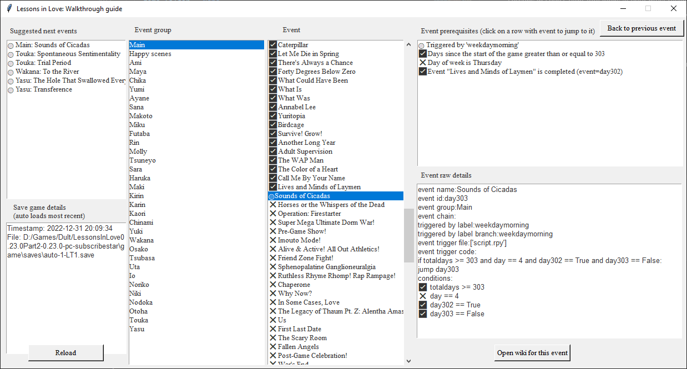

# Lessons In Love Walkthrough Guide Tool

Welcome to the Lessons In Love event details and guide tool website. The guide tool is the recommended experience since it will automatically parse your save-game to recommend the next events and how to reach them. A detailed list of events along with their code are published here in case you are stuck on a particular event or are unable to use the guide tool.

This is an open source project with the code available at [https://github.com/largestack/Lessons-In-Love-Guide-Tool](https://github.com/largestack/Lessons-In-Love-Guide-Tool).

## Interactive guide tool
Tired of endlessly clicking to try and figure out what the next event you can trigger in Lessons In Love is? This tool will automatically analyze your save file to give you a hint of what your next action should be and its prerequisites. End all the endless trial and error to find the next event to trigger!

Download the [latest release](https://github.com/largestack/Lessons-In-Love-Guide-Tool/releases) executable here and run it.

### Using the tool

1. Run the tool.
1. On first run, it will ask you to select the base game folder.
1. It will automatically load the most recent save-game every time it loads.
1. You can also hit the "Reload" to load the most recent save game again. You can do this to refresh the guide tool while you play the game. Simply save your game, then hit "Reload" to update the guide.

* **Suggested next events**: Click on these events to see what's required for the next suggested events.
* **Event group**: Browse events by character and main path.
* **Event**: The list of events for the selected event group.
* **Event prerequisites**: The requirements for the event to trigger.
* **Event raw details**: Some extra notes about the event.

# Event details

Here is a list of events along with their details and code. These are generated automatically through code analysis and includes some errors. If you are stuck on an event, I recommend viewing the full event page and the notes and code may hint at how to trigger the event.

Main events:

* [Main](#main)
* [Happy scenes](#happy-scenes)

Characters:

* [Ami](#ami)
* [Ayane](#ayane)
* [Chika](#chika)
* [Chinami](#chinami)
* [Futaba](#futaba)
* [Haruka](#haruka)
* [Imani](#imani)
* [Io](#io)
* [Kaori](#kaori)
* [Karin](#karin)
* [Kirin](#kirin)
* [Maki](#maki)
* [Makoto](#makoto)
* [Maya](#maya)
* [Miku](#miku)
* [Molly](#molly)
* [Niki](#niki)
* [Nodoka](#nodoka)
* [Noriko](#noriko)
* [Osako](#osako)
* [Otoha](#otoha)
* [Rin](#rin)
* [Sana](#sana)
* [Sara](#sara)
* [Touka](#touka)
* [Tsubasa](#tsubasa)
* [Tsukasa](#tsukasa)
* [Tsuneyo](#tsuneyo)
* [Uta](#uta)
* [Wakana](#wakana)
* [Yasu](#yasu)
* [Yuki](#yuki)
* [Yumi](#yumi)
## Main

| Event | Prerequisites | Next Events |
| --- | --- | --- |
| [Every Day I Grow Some More](./events/start.md) |  |  |
| [A New You](./events/startsleepover.md) | Part of event chain [Every Day I Grow Some More](./events/start.md) |  |
| [Am I Awake?](./events/firstfriday.md) | Day of week is Friday  Part of event chain [A New You](./events/startsleepover.md) |  |
| [First  Day of School](./events/thefirstclass.md) | Part of event chain [Am I Awake?](./events/firstfriday.md) |  |
| [Slumber Party](./events/slumparty.md) | Part of event chain [First  Day of School](./events/thefirstclass.md) |  |
| [The Devil Incarnate](./events/day5.md) | Days since the start of the game greater than or equal to 5   |  |
| [Super Secret Sex Dungeon](./events/day7.md) | Days since the start of the game greater than or equal to 7   |  |
| [Delinquent](./events/day8.md) | Days since the start of the game greater than or equal to 8   |  |
| [Mitochondria](./events/day12.md) | Days since the start of the game greater than or equal to 12   |  |
| [Self-Esteem](./events/day14.md) | Days since the start of the game greater than or equal to 14   |  |
| [Operation: Fallen Angel](./events/day16.md) | Days since the start of the game greater than or equal to 16 Event [The Unwavering Bravery of Ayane Amamiya](./firsttimedojo.md) (Ayane) is completed)   | [Cleaning Duty](./day36.md) (Main)  |
| [I Thought of You](./events/day20.md) | Days since the start of the game greater than or equal to 20   |  |
| [Not Even Me](./events/day21.md) | Days since the start of the game greater than or equal to 21 Event [Five Million Dollars](./firsttimestreets.md) (Yumi) is completed)   |  |
| [No Romeo](./events/day24.md) | Days since the start of the game greater than or equal to 24   | [Couple's Discount](./aminew1.md) (Ami) [No One Can See Us](./amidorm10.md) (Ami)  |
| [Outside of Everything](./events/day26.md) | Days since the start of the game greater than or equal to 26   |  |
| [Ponytail](./events/day28.md) | Days since the start of the game greater than or equal to 28   |  |
| [Drowning](./events/day30.md) | Days since the start of the game greater than or equal to 30 Event [The Flavor of Love](./cafesugar.md) (Rin) is completed)   | [Window of the Waking Mind](./cafe15.md) (Rin)  |
| [So Many Voices](./events/day33.md) | Days since the start of the game greater than or equal to 33   |  |
| [Cleaning Duty](./events/day36.md) | Days since the start of the game greater than or equal to 36 Event [Operation: Fallen Angel](./day16.md) (Main) is completed) Event [The Bare Minimum](./bar5.md) (Sana) is completed)   | [Walk in the Park](./day38.md) (Main)  |
| [Walk in the Park](./events/day38.md) | Days since the start of the game greater than or equal to 38 Event [Unexpected Profession](./firsttimepornshop.md) (Makoto) is completed) Event [Cleaning Duty](./day36.md) (Main) is completed)   | [This Town Has Two Halves](./day44.md) (Main) [Rising of the Tide](./pornshop10.md) (Makoto)  |
| [Saved by the Bell](./events/day40.md) | Days since the start of the game greater than or equal to 40   |  |
| [This Town Has Two Halves](./events/day44.md) | Days since the start of the game greater than or equal to 44 Event [Walk in the Park](./day38.md) (Main) is completed)   | [I See You](./streets10.md) (Yumi)  |
| [Little Girl](./events/day48.md) | Days since the start of the game greater than or equal to 48   |  |
| [Missing](./events/day50.md) | Days since the start of the game greater than or equal to 50 Event [Window of the Waking Mind](./cafe15.md) (Rin) is completed)   | [Nothing Was Missing, Except Me](./cafe20.md) (Rin) [Delirium](./rindorm20.md) (Rin)  |
| [The Sakakibara Diet](./events/day54.md) | Days since the start of the game greater than or equal to 54   |  |
| [Normal Office Visit](./events/day56.md) | Days since the start of the game greater than or equal to 56 Event [Different Worlds](./shrine5.md) (Maya) is completed)   | [Ode to a Marsh Warbler](./aminew2.md) (Ami)  |
| [O World](./events/day60.md) | Part of event chain [Ode to a Marsh Warbler](./events/aminew2.md) | [No One Can See Us](./amidorm10.md) (Ami)  |
| [One to Seven](./events/day63.md) | Days since the start of the game greater than or equal to 63 Event [Delirium](./rindorm20.md) (Rin) is completed)   | [Stronger I Become](./day91.md) (Main)  |
| [Girl-Talk](./events/day65.md) | Days since the start of the game greater than or equal to 65 Event [Carry Me Home](./bar15.md) (Sana) is completed) Event [Nothing Was Missing, Except Me](./cafe20.md) (Rin) is completed)   | [Milk, Eggs, and Water](./day89.md) (Main) [Stronger I Become](./day91.md) (Main) [Scouting Mission](./bar20.md) (Sana) [Good Day, Humans](./cafe25.md) (Rin)  |
| [The 'S' Word](./events/day70.md) | Days since the start of the game greater than or equal to 70 Event [Supermom](./bar10.md) (Sana) is completed)   | [Weight Limit](./day72.md) (Main)  |
| [Weight Limit](./events/day72.md) | Days since the start of the game greater than or equal to 72 Event [The 'S' Word](./day70.md) (Main) is completed)   | [Secret Ingredient](./day80.md) (Main) [Great Burdock Leaves](./futabanew2.md) (Futaba)  |
| [Slope Intercept Form](./events/day77.md) | Days since the start of the game greater than or equal to 77   | [Declaration of War](./makotoinvite1.md) (Makoto) [Studious Teen Virgin](./makotoinvite2.md) (Makoto)  |
| [Scientific Research](./events/day79.md) | Days since the start of the game greater than or equal to 79 Day of week is Friday Event [A Castle for Everyone](./chikadorm15.md) (Chika) is completed)   | [What's Done is Done](./beachvacation1.md) (Main) [A Dog that Doesn't Do Math](./mall15.md) (Chika)  |
| [Secret Ingredient](./events/day80.md) | Days since the start of the game greater than or equal to 80 Event [Weight Limit](./day72.md) (Main) is completed)   |  |
| [Parasite](./events/day83.md) | Days since the start of the game greater than or equal to 83 Event [You and Me and the Night](./mikudorm10.md) (Miku) is completed)   | [Hormones Running Wild](./soccer15.md) (Miku)  |
| [Contractions](./events/day85.md) | Days since the start of the game greater than or equal to 85 Event [I See You](./streets10.md) (Yumi) is completed)   | [A Different View](./day121.md) (Main) [Rumors](./day138.md) (Main)  |
| [Milk, Eggs, and Water](./events/day89.md) | Days since the start of the game greater than or equal to 89 Event [Girl-Talk](./day65.md) (Main) is completed)   | [Drunk Again](./harukadate1.md) (Haruka)  |
| [Stronger I Become](./events/day91.md) | Days since the start of the game greater than or equal to 91 Event [One to Seven](./day63.md) (Main) is completed) Event [Girl-Talk](./day65.md) (Main) is completed)   | [Girl Talk Pt. II](./day120.md) (Main)  |
| [Recall](./events/day96.md) | Days since the start of the game greater than or equal to 96 Day of week is Monday Event [You and Me](./shrine15.md) (Maya) is completed) Event [Imprinting](./ayanenew1.md) (Ayane) is completed)   | [Rewrite](./day102.md) (Main)  |
| [Rewrite](./events/day102.md) | Days since the start of the game greater than or equal to 102 Day of week is Sunday Event [Recall](./day96.md) (Main) is completed) Event [Takoyaki](./mayadorm15.md) (Maya) is completed) letterttrack equal to True (unknown variable) howifeeltrack equal to True (unknown variable)   | [Reset](./day103.md) (Main)  |
| [Reset](./events/day103.md) | Days since the start of the game greater than or equal to 103 Event [Rewrite](./day102.md) (Main) is completed)   | [Cursed Birds](./day110.md) (Main) [Human Trafficking](./day114.md) (Main) [Girl Talk Pt. II](./day120.md) (Main) [A Different View](./day121.md) (Main) [On The Bright Side](./day126.md) (Main) [Everything Horrible](./day128.md) (Main) [Rumors](./day138.md) (Main) [Walking Penis Monster](./karindate5.md) (Karin)  |
| [Cursed Birds](./events/day110.md) | Days since the start of the game greater than or equal to 110 Event [Reset](./day103.md) (Main) is completed)   |  |
| [Human Trafficking](./events/day114.md) | Days since the start of the game greater than or equal to 114 Event [Reset](./day103.md) (Main) is completed) Event [Scouting Mission](./bar20.md) (Sana) is completed)   |  |
| [Girl Talk Pt. II](./events/day120.md) | Days since the start of the game greater than or equal to 120 Event [Reset](./day103.md) (Main) is completed) Event [Stronger I Become](./day91.md) (Main) is completed)   | [Self-Medication](./bar30.md) (Sana)  |
| [A Different View](./events/day121.md) | Days since the start of the game greater than or equal to 121 Event [Contractions](./day85.md) (Main) is completed) Event [Reset](./day103.md) (Main) is completed)   |  |
| [On The Bright Side](./events/day126.md) | Days since the start of the game greater than or equal to 126 Event [Reset](./day103.md) (Main) is completed) Event [Apples to Apples](./streets15.md) (Yumi) is completed) Event [A Castle for Everyone](./chikadorm15.md) (Chika) is completed)   | [Everything Horrible](./day128.md) (Main)  |
| [Everything Horrible](./events/day128.md) | Days since the start of the game greater than or equal to 128 Event [Reset](./day103.md) (Main) is completed) Event [On The Bright Side](./day126.md) (Main) is completed) Day of week is Friday   | [Erotic Game Protagonist](./day130.md) (Main) [Tsuneyo Tojo, Stand-up Comedian](./day144.md) (Main) [Chinami-Corp](./chinamidate5.md) (Chinami)  |
| [Erotic Game Protagonist](./events/day130.md) | Days since the start of the game greater than or equal to 130 Event [Everything Horrible](./day128.md) (Main) is completed) Day of week is a weekend   | [Rumors](./day138.md) (Main)  |
| [Rumors](./events/day138.md) | Days since the start of the game greater than or equal to 138 Event [Reset](./day103.md) (Main) is completed) Event [Erotic Game Protagonist](./day130.md) (Main) is completed) Event [Contractions](./day85.md) (Main) is completed)   | [The Gem of the Emerald Isle](./day140.md) (Main)  |
| [The Gem of the Emerald Isle](./events/day140.md) | Days since the start of the game greater than or equal to 140 Event [Rumors](./day138.md) (Main) is completed)   | [Size Matters](./day142.md) (Main)  |
| [Size Matters](./events/day142.md) | Days since the start of the game greater than or equal to 142 Event [Back Out in the Heat](./amidorm15.md) (Ami) is completed) Event [The Gem of the Emerald Isle](./day140.md) (Main) is completed)   | [Tsuneyo Tojo, Stand-up Comedian](./day144.md) (Main)  |
| [Tsuneyo Tojo, Stand-up Comedian](./events/day144.md) | Days since the start of the game greater than or equal to 144 Event [Everything Horrible](./day128.md) (Main) is completed) Event [Size Matters](./day142.md) (Main) is completed)   | [A Proper Introduction](./day150.md) (Main)  |
| [A Proper Introduction](./events/day150.md) | Days since the start of the game greater than or equal to 150 Event [Tsuneyo Tojo, Stand-up Comedian](./day144.md) (Main) is completed) Event [Apples to Apples](./streets15.md) (Yumi) is completed) Event [Nothing Was Missing, Except Me](./cafe20.md) (Rin) is completed) Event [Nightvision](./soccer10.md) (Miku) is completed)   | [Supreme Overlord](./day153.md) (Main)  |
| [Supreme Overlord](./events/day153.md) | Days since the start of the game greater than or equal to 153 Event [A Proper Introduction](./day150.md) (Main) is completed)   | [Lifting the Curse](./day154.md) (Main)  |
| [Lifting the Curse](./events/day154.md) | Days since the start of the game greater than or equal to 154 Event [Supreme Overlord](./day153.md) (Main) is completed)   | [What's Done is Done](./beachvacation1.md) (Main) [NTR & Pregnancy](./mollycafe1.md) (Molly) [The Cult of Molly](./mollyfirsthall.md) (Molly) [Snake Venom](./ramen1.md) (Tsuneyo) [The Life of a Blue Whale](./tsuneyofirsthall.md) (Tsuneyo)  |
| [What's Done is Done](./events/beachvacation1.md) | Days since the start of the game greater than or equal to 174 Event [Lifting the Curse](./day154.md) (Main) is completed) Event [Back Out in the Heat](./amidorm15.md) (Ami) is completed) Event [Legs of a Dying Spider](./futabadorm15.md) (Futaba) is completed) Event [Scientific Research](./day79.md) (Main) is completed) Event [Egg Tooth](./makotonew3.md) (Makoto) is completed) Event [Partners in Crime](./kirindate1.md) (Kirin) is completed) Event [Snake Venom](./ramen1.md) (Tsuneyo) is completed) Event [The Dark Entity](./mollydorm10.md) (Molly) is completed) Event [Sock Fetish](./rindorm25.md) (Rin) is completed) Event [Supermom](./bar10.md) (Sana) is completed) Day of week is Saturday   |  |
| [All Along the Shoreline](./events/beachvacation2.md) | Part of event chain [What's Done is Done](./events/beachvacation1.md) |  |
| [My Heart is Full](./events/beachvacation3.md) | Part of event chain [All Along the Shoreline](./events/beachvacation2.md) |  |
| [Extra French Fries](./events/beachvacation4.md) | Part of event chain [My Heart is Full](./events/beachvacation3.md) |  |
| [Behind a Bathroom, Under the Blazing Sun](./events/beachvacation5.md) | Part of event chain [Extra French Fries](./events/beachvacation4.md) |  |
| [Three Girls in a Line on the Beach](./events/beachvacation6.md) | Part of event chain [Behind a Bathroom, Under the Blazing Sun](./events/beachvacation5.md) |  |
| [The Moon is Beautiful](./events/beachvacation7.md) | Part of event chain [Three Girls in a Line on the Beach](./events/beachvacation6.md) |  |
| [The Legacy of Thaum Pt. I](./events/beachvacation8.md) | Part of event chain [The Moon is Beautiful](./events/beachvacation7.md) |  |
| [Summer and Winter](./events/beachvacation9.md) | Part of event chain [The Legacy of Thaum Pt. I](./events/beachvacation8.md) |  |
| [Where Puppies Roam Free](./events/beachvacation10.md) | Part of event chain [Wake Up Call](./events/amilust10.md) |  |
| [Die For What You Believe In](./events/beachvacation11.md) | Part of event chain [Where Puppies Roam Free](./events/beachvacation10.md) |  |
| [Reverse Cowgirl](./events/beachvacation12.md) | Part of event chain [Die For What You Believe In](./events/beachvacation11.md) |  |
| [Smile Guide](./events/beachvacation13.md) | Part of event chain [Prisoner](./events/ayanelust10.md) |  |
| [Prayer Position](./events/beachvacation14.md) | Part of event chain [Smile Guide](./events/beachvacation13.md) |  |
| [Cry. Cry. Cry.](./events/beachvacation15.md) | Part of event chain [Prayer Position](./events/beachvacation14.md) |  |
| [See You in the Morning](./events/beachvacation16.md) | Part of event chain [Cry. Cry. Cry.](./events/beachvacation15.md) | [The Value of Sharing](./halloween1.md) (Main) [Cute Girls and Stuff](./amisroom20.md) (Ami) [Nothing is Real](./shrine20.md) (Maya) [The Girl in the Black Dress](./sanadorm25.md) (Sana) [Under the Table](./library30.md) (Futaba) [Nothing Was Different](./cafe30.md) (Rin) [Long and Hard](./kirindate5.md) (Kirin)  |
| [The Value of Sharing](./events/halloween1.md) | Days since the start of the game greater than or equal to 200 Day of week is Friday Event [See You in the Morning](./beachvacation16.md) (Main) is completed) Event [A Trip to the Moon](./chikainvite1.md) (Chika) is completed) Event [Drunk Again](./harukadate1.md) (Haruka) is completed) Event [How to Date a Human](./kaoridate1.md) (Kaori) is completed) Event [Good Day, Humans](./cafe25.md) (Rin) is completed) Event [Life is a Tomato](./bar25.md) (Sana) is completed) Event [FLAVOR BEAM!](./mayadorm25.md) (Maya) equal to Tru (event=mayadorm25)   |  |
| [Guest of Honor](./events/halloween2.md) | Part of event chain [The Value of Sharing](./events/halloween1.md) |  |
| [The Meat has Come](./events/halloween3.md) | Part of event chain [Guest of Honor](./events/halloween2.md) |  |
| [Mysterious Abundance of Chickens](./events/halloween4.md) | Part of event chain [The Meat has Come](./events/halloween3.md) |  |
| [Sexy Land](./events/halloween5.md) | Part of event chain [Mysterious Abundance of Chickens](./events/halloween4.md) |  |
| [They're Just Lights](./events/halloween6.md) | Part of event chain [Sexy Land](./events/halloween5.md) |  |
| [Once, Twice, Ten Times](./events/halloween7.md) | Part of event chain [They're Just Lights](./events/halloween6.md) |  |
| [Mechanical Bull](./events/halloween8.md) | Part of event chain [Medical Assistance](./events/saralust10.md) |  |
| [At Least It's Not Christmas](./events/halloween9.md) | Part of event chain [Mechanical Bull](./events/halloween8.md) |  |
| [Samhain](./events/halloween10.md) | Part of event chain [At Least It's Not Christmas](./events/halloween9.md) |  |
| [Wicked Witch of Kumon-mi](./events/halloween11.md) | Part of event chain [Samhain](./events/halloween10.md) |  |
| [The Depressing Implication of Goosebumps](./events/halloween12.md) | Part of event chain [Wicked Witch of Kumon-mi](./events/halloween11.md) |  |
| [Pry With a Smile](./events/halloween13.md) | Part of event chain [The Depressing Implication of Goosebumps](./events/halloween12.md) |  |
| [Kadrillionbilliontrillion](./events/halloween14.md) | Part of event chain [Pry With a Smile](./events/halloween13.md) | [As Loud as a Whisper Can Be](./day214.md) (Main) [Regularly Scheduled Programming](./dojo25.md) (Ayane) [Aftermath](./pornshop20.md) (Makoto) [Thighs On-Demand](./soccer25.md) (Miku) [Performance Review](./harukadate10.md) (Haruka) [The Best Ways to Rub a Cock](./kaoridate5.md) (Kaori)  |
| [As Loud as a Whisper Can Be](./events/day214.md) | Days since the start of the game greater than or equal to 214 Event [Maki Miyamura's Mom-Mode Mission](./makidate5.md) (Maki) is completed) Event [Kadrillionbilliontrillion](./halloween14.md) (Main) is completed) Event [Bluejay](./makotodorm25.md) (Makoto) is completed) Event [One. Two. Three.](./mikudorm30.md) (Miku) is completed) Event [Everlasting Love](./amidorm25.md) (Ami) is completed) Day of week is Monday   | [Two Wooden Doors](./day215.md) (Main)  |
| [Two Wooden Doors](./events/day215.md) | Days since the start of the game greater than or equal to 215 Event [As Loud as a Whisper Can Be](./day214.md) (Main) is completed) Day of week is Tuesday   | [Happy Places](./day216.md) (Main)  |
| [Happy Places](./events/day216.md) | Days since the start of the game greater than or equal to 216 Event [Two Wooden Doors](./day215.md) (Main) is completed) Day of week is Wednesday   | [Tradition](./day217.md) (Main)  |
| [Tradition](./events/day217.md) | Days since the start of the game greater than or equal to 217 Event [Happy Places](./day216.md) (Main) is completed) Day of week is Thursday   | [Stray Cat](./day218.md) (Main)  |
| [Stray Cat](./events/day218.md) | Days since the start of the game greater than or equal to 218 Event [Tradition](./day217.md) (Main) is completed) Day of week is Friday   |  |
| [There is Nothing](./events/day220.md) |  |  |
| [Changing of Seasons](./events/hoorayanotherreset.md) | passcode equal to "Boobies123" (unknown variable)  Part of event chain [There is Nothing](./events/day220.md) |  |
| [Snow-Covered Footprints](./events/christmas1.md) | Part of event chain [Changing of Seasons](./events/hoorayanotherreset.md) |  |
| [Patent-Pending](./events/christmas2.md) | Part of event chain [Snow-Covered Footprints](./events/christmas1.md) |  |
| [Fuck Christmas](./events/christmas3.md) | Part of event chain [Patent-Pending](./events/christmas2.md) |  |
| [Disappointing Everyone](./events/christmas4.md) | Part of event chain [Fuck Christmas](./events/christmas3.md) |  |
| [Bottled Dreams](./events/christmas5.md) | Part of event chain [Disappointing Everyone](./events/christmas4.md) |  |
| [Christmas Miracle](./events/christmas6.md) | Part of event chain [Baby it's Cold Outside](./events/chikalust10.md) |  |
| [Fireworks, Chicken, and the Innate Fear of Death](./events/christmas7.md) | Part of event chain [Selfless](./events/futabalust10.md) | [Living](./amiinvite1.md) (Ami) [Rising to the Challenge](./amiinvite2.md) (Ami) [Best Friends Forever](./amiinvite3.md) (Ami) [Hail Mary](./ayaneinvite1.md) (Ayane) [One of Many Rooms](./ayaneinvite2.md) (Ayane) [Purest Intentions](./bar35.md) (Sana) [Semblance of a Soul](./makotolust10.md) (Makoto) [Sonnet 18](./futabainvite1.md) (Futaba) [Floral Aura](./futabainvite2.md) (Futaba) [Too Blind To See](./futabainvite3.md) (Futaba) [Sketchy Basement](./cafe40.md) (Rin) [Onward to Valhalla](./mollycafe15.md) (Molly) [Unpaid Promotion](./mollydorm15.md) (Molly) [Seeds](./ramen15.md) (Tsuneyo) [Shades of Green](./harukainvite1.md) (Haruka) [Roses](./harukainvite2.md) (Haruka) [Unfiltered Tap Water](./harukainvite3.md) (Haruka) [A Fair Trade](./makidate10.md) (Maki) [Full Blossom](./kirinlust5.md) (Kirin) [Too Much, All at Once](./kirininvite1.md) (Kirin) [No Extortion Necessary](./kirininvite2.md) (Kirin) [Giant Pool of Jell-O](./chinamidate10.md) (Chinami) [Suicide Pact](./day237.md) (Main)  |
| [Suicide Pact](./events/day237.md) | Days since the start of the game greater than or equal to 237 Day of week is Monday Event [Fireworks, Chicken, and the Innate Fear of Death](./christmas7.md) (Main) is completed)   | [A Door that People Move Through](./day239.md) (Main)  |
| [A Door that People Move Through](./events/day239.md) | Days since the start of the game greater than or equal to 239 Day of week is Wednesday Event [Suicide Pact](./day237.md) (Main) is completed)   | [Uta's Last Stand](./day240.md) (Main)  |
| [Uta's Last Stand](./events/day240.md) | Days since the start of the game greater than or equal to 240 Day of week is Thursday Event [A Door that People Move Through](./day239.md) (Main) is completed)   | [Opposites Attract](./day244.md) (Main)  |
| [Opposites Attract](./events/day244.md) | Days since the start of the game greater than or equal to 244 Day of week is Monday Event [Uta's Last Stand](./day240.md) (Main) is completed)   | [All Kinds of People, All Kinds of Things](./day246.md) (Main)  |
| [All Kinds of People, All Kinds of Things](./events/day246.md) | Days since the start of the game greater than or equal to 246 Day of week is Wednesday Event [Opposites Attract](./day244.md) (Main) is completed)   | [Caterpillar](./day247.md) (Main)  |
| [Caterpillar](./events/day247.md) | Days since the start of the game greater than or equal to 247 Day of week is Thursday Event [All Kinds of People, All Kinds of Things](./day246.md) (Main) is completed)   | [Fucking...Or What it Means to Live](./tsuneyodorm20.md) (Tsuneyo) [Let Me Die in Spring](./day261.md) (Main) [Far From Home](./utafirsthall.md) (Uta) [Abuse of Power](./utamaid1.md) (Uta) [Viva la Revolución](./iofirsthall.md) (Io) [Nonetheless, I'm Here](./bathhouse1.md) (Io)  |
| [Let Me Die in Spring](./events/day261.md) | Days since the start of the game greater than or equal to 261 Day of week is Wednesday Event [Caterpillar](./day247.md) (Main) is completed) Event [No Extortion Necessary](./kirininvite2.md) (Kirin) is completed) Event [Purest Intentions](./bar35.md) (Sana) is completed)   | [There's Always a Chance](./day263.md) (Main)  |
| [There's Always a Chance](./events/day263.md) | Days since the start of the game greater than or equal to 263 Day of week is Friday Event [Let Me Die in Spring](./day261.md) (Main) is completed)   | [Forty Degrees Below Zero](./day264.md) (Main)  |
| [Forty Degrees Below Zero](./events/day264.md) | Days since the start of the game greater than or equal to 264 Day of week is Monday Event [There's Always a Chance](./day263.md) (Main) is completed)   | [Dying Alone With Ten Cats](./karindate15.md) (Karin) [What Could Have Been](./day269.md) (Main)  |
| [What Could Have Been](./events/day269.md) | Days since the start of the game greater than or equal to 269 Day of week is Wednesday Event [Forty Degrees Below Zero](./day264.md) (Main) is completed)   | [What Is](./day270.md) (Main)  |
| [What Is](./events/day270.md) | Days since the start of the game greater than or equal to 270 Day of week is Thursday Event [What Could Have Been](./day269.md) (Main) is completed)   | [What Was](./day271.md) (Main)  |
| [What Was](./events/day271.md) | Days since the start of the game greater than or equal to 271 Day of week is Friday Event [What Is](./day270.md) (Main) is completed)   | [Loxonin](./soccer35.md) (Miku) [She's Always a Woman](./sarabar20.md) (Sara) [Morals vs. Orgasms](./kirinfirsthall.md) (Kirin) [Love, Dorms, and Other Things](./kirindorm10.md) (Kirin) [Tendrils of Flame](./karinsoccer15.md) (Karin) [To Die, To Sleep](./kaoridate15.md) (Kaori) [Annabel Lee](./day280.md) (Main) [Sculpture](./norikofirsthall.md) (Noriko)  |
| [Annabel Lee](./events/day280.md) | Days since the start of the game greater than or equal to 280 Day of week is Monday Event [What Was](./day271.md) (Main) is completed) Event [The Art of Never Knowing](./rindorm45.md) (Rin) is completed) Event [Paperthin](./iodorm10.md) (Io) is completed) Event [Like it's Any Other Day](./nikidate5.md) (Niki) is completed) Event [Zanzibar](./chikaonsen4.md) (Chika) is completed) Event [Walls Too Thick to Hear Through](./yumidorm30.md) (Yumi) is completed) Event [Sculpture](./norikofirsthall.md) (Noriko) is completed) Event [Mouthjob](./convenience5.md) (Noriko) is completed)   | [Yuritopia](./day281.md) (Main)  |
| [Yuritopia](./events/day281.md) | Days since the start of the game greater than or equal to 281 Day of week is Tuesday Event [Annabel Lee](./day280.md) (Main) is completed)   | [Birdcage](./day282.md) (Main)  |
| [Birdcage](./events/day282.md) | Days since the start of the game greater than or equal to 282 Day of week is Wednesday Event [Yuritopia](./day281.md) (Main) is completed)   | [Survive! Grow!](./day283.md) (Main)  |
| [Survive! Grow!](./events/day283.md) | Days since the start of the game greater than or equal to 283 Day of week is Thursday Event [Birdcage](./day282.md) (Main) is completed)   | [Another Long Year](./day287.md) (Main)  |
| [Another Long Year](./events/day287.md) | Days since the start of the game greater than or equal to 287 Day of week is Monday Event [Survive! Grow!](./day283.md) (Main) is completed)   | [Adult Supervision](./day288.md) (Main)  |
| [Adult Supervision](./events/day288.md) | Days since the start of the game greater than or equal to 288 Day of week is Tuesday Event [Another Long Year](./day287.md) (Main) is completed)   | [The WAP Man](./day295.md) (Main) [Humbert Humbert](./nodokafirsthall.md) (Nodoka) [The Man Who Would Be King](./nodokadorm1.md) (Nodoka) [Everybody Loves Otoha](./otohafirsthall.md) (Otoha)  |
| [The WAP Man](./events/day295.md) | Days since the start of the game greater than or equal to 295 Day of week is Wednesday Event [Adult Supervision](./day288.md) (Main) is completed) Event [Zanzibar](./chikaonsen4.md) (Chika) is completed) Event [The Big Sleep](./amidate35.md) (Ami) is completed) Event [Something, Somewhere](./makotowinterbeach4.md) (Makoto) is completed)   |  |
| [The Color of a Heart](./events/day295parttwo.md) | Part of event chain [The WAP Man](./events/day295.md) | [Call Me By Your Name](./day297.md) (Main)  |
| [Call Me By Your Name](./events/day297.md) | Days since the start of the game greater than or equal to 297 Day of week is Friday Event [The Color of a Heart](./day295parttwo.md) (Main) is completed)   | [Lives and Minds of Laymen](./day302.md) (Main)  |
| [Lives and Minds of Laymen](./events/day302.md) | Days since the start of the game greater than or equal to 302 Day of week is Wednesday Event [Call Me By Your Name](./day297.md) (Main) is completed)   | [Sounds of Cicadas](./day303.md) (Main)  |
| [Sounds of Cicadas](./events/day303.md) | Days since the start of the game greater than or equal to 303 Day of week is Thursday Event [Lives and Minds of Laymen](./day302.md) (Main) is completed)   | [Horses or the Whispers of the Dead](./day304.md) (Main)  |
| [Horses or the Whispers of the Dead](./events/day304.md) | Days since the start of the game greater than or equal to 304 Day of week is Friday Event [Sounds of Cicadas](./day303.md) (Main) is completed)   | [Spontaneous Sentimentality](./toukafirsthall.md) (Touka) [Trial Period](./toukastreets1.md) (Touka) [The Hole That Swallowed Everything](./yasufirsthall.md) (Yasu)  |
| [Operation: Firestarter](./events/day318.md) | Days since the start of the game greater than or equal to 318 Day of week is Friday Event [Loser](./toukadorm5.md) (Touka) is completed) Event [Shawshank Redemption](./utadorm10.md) (Uta) is completed) Event [Speed of Light](./mikudorm40.md) (Miku) is completed) Event [Ahead of the Curve](./mollydorm20.md) (Molly) is completed) Event [Highly Pornographic](./otohadorm5.md) (Otoha) is completed) Event [Terms & Conditions](./kirindorm20.md) (Kirin) is completed) Event [Paperthin](./iodorm10.md) (Io) is completed) Event [Better Off Alone](./yukidate5.md) (Yuki) is completed) Event [The Inside of a Triangle](./sanadorm40.md) (Sana) is completed) Event [Repentance](./yasudorm10.md) (Yasu) is completed)   |  |
| [Super Mega Ultimate Dorm War!](./events/dormwar1.md) | Part of event chain [Operation: Firestarter](./events/day318.md) |  |
| [Pre-Game Show!](./events/dormwar2.md) | Part of event chain [Super Mega Ultimate Dorm War!](./events/dormwar1.md) |  |
| [Imouto Mode!](./events/dormwar3.md) | Part of event chain [Pre-Game Show!](./events/dormwar2.md) |  |
| [Alive & Active! All Out Athletics!](./events/dormwar4.md) | Part of event chain [Imouto Mode!](./events/dormwar3.md) |  |
| [Friend Zone Fight!](./events/dormwar5.md) | Part of event chain [Alive & Active! All Out Athletics!](./events/dormwar4.md) |  |
| [Sphenopalatine Ganglioneuralgia](./events/dormwar6.md) | Part of event chain [Friend Zone Fight!](./events/dormwar5.md) |  |
| [Ruthless Rhyme Rhomp! Rap Rampage!](./events/dormwar7.md) | Part of event chain [Sphenopalatine Ganglioneuralgia](./events/dormwar6.md) |  |
| [Chaperone](./events/dormwar8.md) | Part of event chain [Ruthless Rhyme Rhomp! Rap Rampage!](./events/dormwar7.md) |  |
| [Why Now?](./events/dormwar9.md) | Part of event chain [Chaperone](./events/dormwar8.md) |  |
| [In Some Cases, Love](./events/dormwar10.md) | Part of event chain [Why Now?](./events/dormwar9.md) |  |
| [The Legacy of Thaum Pt. Z: Alentha Amastacia](./events/dormwar11.md) | Part of event chain [In Some Cases, Love](./events/dormwar10.md) |  |
| [Us](./events/dormwar12.md) | Part of event chain [The Legacy of Thaum Pt. Z: Alentha Amastacia](./events/dormwar11.md) |  |
| [First Last Date](./events/dormwar13.md) | Part of event chain [Us](./events/dormwar12.md) |  |
| [The Scary Room](./events/dormwar14.md) | Part of event chain [First Last Date](./events/dormwar13.md) |  |
| [Fallen Angels](./events/dormwar15.md) | Part of event chain [The Scary Room](./events/dormwar14.md) |  |
| [Post-Game Celebration!](./events/dormwar16.md) | Part of event chain [Fallen Angels](./events/dormwar15.md) |  |
| [War's End](./events/dormwar17.md) | Part of event chain [The Princess & The Pauper](./events/chikalust15.md) | [Skin](./futabadorm40.md) (Futaba) [Sober-ish](./harukadate20.md) (Haruka) [Record Breaker](./day333.md) (Main) [Happier Things](./utamaid10.md) (Uta) [Turn On The Lights](./bathhouse10.md) (Io)  |
| [Record Breaker](./events/day333.md) | Days since the start of the game greater than or equal to 333 Event [War's End](./dormwar17.md) (Main) is completed)   |  |
| [Lesbian Stuff](./events/day333part2.md) | Part of event chain [Record Breaker](./events/day333.md) | [Under the World Tree](./dojo35.md) (Ayane)  |
| [Mana Transfer](./events/day340.md) | Days since the start of the game greater than or equal to 340 Event [Crash of Thunder](./ayanedorm35.md) (Ayane) is completed) Day of week is Tuesday   | [The Price of Experience](./day344.md) (Main)  |
| [The Price of Experience](./events/day344.md) | Days since the start of the game greater than or equal to 344 Event [Mana Transfer](./day340.md) (Main) is completed) Event [Best Friends Forever](./amiinvite3.md) (Ami) is completed) Day of week is Saturday   |  |
| [Word of the Day](./events/thirdreset1.md) | Part of event chain [Nevermind](./events/ayanespecial1.md) |  |
| [Backwards Dancing](./events/thirdreset2.md) | Part of event chain [Word of the Day](./events/thirdreset1.md) |  |
| [Sayonara](./events/thirdreset3.md) | Part of event chain [Backwards Dancing](./events/thirdreset2.md) | [Sweet Vermouth](./bar45.md) (Sana) [The Complete Absence of Everything](./sanadorm45.md) (Sana) [Food Groups](./day351.md) (Main)  |
| [Food Groups](./events/day351.md) | Days since the start of the game greater than or equal to 351 Event [Sayonara](./thirdreset3.md) (Main) is completed) Event [Blood Everywhere](./utadorm20.md) (Uta) is completed)   | [Melatonin](./bar50.md) (Sana) [The Adventures of Karli & Steve](./karinsoccer20.md) (Karin) [Permission Slip](./day355.md) (Main)  |
| [Permission Slip](./events/day355.md) | Days since the start of the game greater than or equal to 355 Event [Food Groups](./day351.md) (Main) is completed)   | [Sweet Tooth](./karindate20.md) (Karin) [Pool Party](./chinamidate15.md) (Chinami) [Good Morning](./secondbeach1.md) (Main)  |
| [Good Morning](./events/secondbeach1.md) | Day of week is Saturday Days since the start of the game greater than or equal to 370 Event [Permission Slip](./day355.md) (Main) is completed) Event [Sweet Tooth](./karindate20.md) (Karin) is completed) Event [Happy Hour](./chinamidate20.md) (Chinami) is completed) Event [Blood Everywhere](./utadorm20.md) (Uta) is completed) Event [Mine](./sanadorm50.md) (Sana) is completed) Event [Floating Forever, Unfulfilled](./osakodojo1.md) (Osako) is completed) Event [All That is Contaminated](./kirindate25.md) (Kirin) is completed)   |  |
| [Egg Tossing](./events/secondbeach2.md) | Part of event chain [Good Morning](./events/secondbeach1.md) |  |
| [De-Briefing the Teacher](./events/secondbeach3.md) | Part of event chain [Egg Tossing](./events/secondbeach2.md) |  |
| [TPK](./events/secondbeach4.md) | Part of event chain [De-Briefing the Teacher](./events/secondbeach3.md) |  |
| [The Next Best Thing](./events/secondbeach5.md) | Part of event chain [TPK](./events/secondbeach4.md) |  |
| [The Yellow Wallpaper](./events/secondbeach6.md) | Part of event chain [The Next Best Thing](./events/secondbeach5.md) |  |
| [Everything Ephemeral](./events/secondbeach7.md) | Kirin lust less than 20  Part of event chain [Taking the Reins](./events/kirinlust20.md) |  |
| [The Legacy of Thaum Pt. III: Changeling](./events/secondbeach8.md) | Part of event chain [Everything Ephemeral](./events/secondbeach7.md) |  |
| [Alderaan](./events/secondbeach9.md) | Part of event chain [The Legacy of Thaum Pt. III: Changeling](./events/secondbeach8.md) |  |
| [Torrential Downpour. Child of Man.](./events/secondbeach10.md) | Part of event chain [Alderaan](./events/secondbeach9.md) |  |
| [Left Out in Light](./events/secondbeach12.md) | Part of event chain [Into the Woods](./events/chikalust20.md) |  |
| [We Were Angels](./events/secondbeach13.md) | Part of event chain [Left Out in Light](./events/secondbeach12.md) |  |
| [Lavender's Blue](./events/secondbeach14.md) | Part of event chain [Hot Water](./events/makotolust20.md) |  |
| [Pluto Was Never Really a Planet](./events/secondbeach15.md) | Part of event chain [Lavender's Blue](./events/secondbeach14.md) |  |
| [Try. Try. Try.](./events/secondbeach16.md) | Part of event chain [Pluto Was Never Really a Planet](./events/secondbeach15.md) |  |
| [Goodnight](./events/secondbeach17.md) | Part of event chain [Try. Try. Try.](./events/secondbeach16.md) |  |
| [All is Bright. All is Beautiful.](./events/secondbeach18.md) | Part of event chain [Goodnight](./events/secondbeach17.md) | [The Paragon of Not Worrying About Stuff](./cafe50.md) (Rin) [Like Noodles in the Wind](./ramen25.md) (Tsuneyo) [Unsleeping Aegis](./tsuneyodorm25.md) (Tsuneyo) [Girls in Spandex](./halloweentwo1.md) (Main) [Thousands, If Not Millions](./nikidate10.md) (Niki)  |
| [Girls in Spandex](./events/halloweentwo1.md) | Days since the start of the game greater than or equal to 400 Event [All is Bright. All is Beautiful.](./secondbeach18.md) (Main) is completed) Event [The Happiest Girl in the World](./rindate50.md) (Rin) is completed) Event [Lifejacket](./rindorm50special.md) (Rin) is completed) rinbetrayed equal to True (unknown variable) Event [Things Like Stairs](./ramen30.md) (Tsuneyo) is completed) Event [Walkthrough](./mollydorm30.md) (Molly) is completed) Event [Hotel Rooms](./nikidate15.md) (Niki) is completed) Day of week is Friday   |  |
| [Butterfly Facts](./events/halloweentwo2.md) | Part of event chain [Girls in Spandex](./events/halloweentwo1.md) |  |
| [Immernachtreich](./events/halloweentwo3.md) | Part of event chain [Butterfly Facts](./events/halloweentwo2.md) |  |
| [Take Me Anywhere](./events/halloweentwo4.md) | Part of event chain [Immernachtreich](./events/halloweentwo3.md) |  |
| [Anglerfish](./events/halloweentwo5.md) | Part of event chain [Take Me Anywhere](./events/halloweentwo4.md) |  |
| [Porcelain Labyrinth](./events/halloweentwo6.md) | Part of event chain [Conscious or Not](./events/amilust20.md) |  |
| [The First Signs of Fraying Threads](./events/halloweentwo7.md) | Part of event chain [Porcelain Labyrinth](./events/halloweentwo6.md) |  |
| [Official Unofficial Double Date](./events/halloweentwo8.md) | Part of event chain [The First Signs of Fraying Threads](./events/halloweentwo7.md) |  |
| [In Circles](./events/halloweentwo9.md) | Part of event chain [Official Unofficial Double Date](./events/halloweentwo8.md) |  |
| [Escape Rope](./events/halloweentwo10.md) | Part of event chain [In Circles](./events/halloweentwo9.md) |  |
| [Lavender's Green](./events/halloweentwo11.md) | Part of event chain [Escape Rope](./events/halloweentwo10.md) |  |
| [Gallows Edge](./events/halloweentwo12.md) | Part of event chain [Lavender's Green](./events/halloweentwo11.md) |  |
| [Metal in Microwaves](./events/halloweentwo13.md) | bonus equal to False (unknown variable)  Part of event chain [Gallows Edge](./events/halloweentwo12.md) | [Traveling Lube Dealer](./makiinvite1.md) (Maki) [Special Occasions](./makiinvite2.md) (Maki) [Baby Steps](./makiinv3.md) (Maki) [Fair & Square](./norikospecial20.md) (Noriko)  |
| [Three Amigos](./events/christmastwo1.md) | Days since the start of the game greater than or equal to 455 Event [The Gap in the Door](./chikadate45.md) (Chika) is completed) Event [See You Around](./yumispecial45.md) (Yumi) is completed) Event [Loxosceles Reclusa](./norikodorm25.md) (Noriko) is completed) Event [Dear You](./nikiinvite2.md) (Niki) is completed) Event [The Place She Falls Asleep At Night](./sarabar25p2.md) (Sara) is completed) Day of week is Thursday   |  |
| [The Reliable and Totally Legitimate Princess Imani](./events/christmastwo2.md) | Part of event chain [Three Amigos](./events/christmastwo1.md) |  |
| [Room to Grow](./events/christmastwo3.md) | Part of event chain [The Reliable and Totally Legitimate Princess Imani](./events/christmastwo2.md) |  |
| [Dodging Snowflakes](./events/christmastwo4.md) | Part of event chain [Room to Grow](./events/christmastwo3.md) |  |
| [Everything Evil](./events/christmastwo5.md) | Part of event chain [Dodging Snowflakes](./events/christmastwo4.md) |  |
| [Tokimeki Labyrinth](./events/christmastwo6.md) | Part of event chain [Everything Evil](./events/christmastwo5.md) |  |
| [Love Set to Max](./events/christmastwo7.md) | Part of event chain [Engulfed](./events/saralust20intro.md) |  |
| [Dohoonkabhankoloos](./events/christmastwo8.md) | Part of event chain [Love Set to Max](./events/christmastwo7.md) |  |
| [Fear of Missing Out](./events/christmastwo9.md) | Part of event chain [Dohoonkabhankoloos](./events/christmastwo8.md) |  |
| [Walking on Eggshells](./events/christmastwo10.md) | Part of event chain [The Other Half](./events/kirinlust202.md) |  |
| [New Age Entrepreneurs](./events/christmastwo11.md) | Part of event chain [Walking on Eggshells](./events/christmastwo10.md) |  |
| [The Smile, The Face](./events/christmastwo12.md) | Part of event chain [New Age Entrepreneurs](./events/christmastwo11.md) |  |
| [Shadowmeld](./events/christmastwo13.md) | Part of event chain [The Smile, The Face](./events/christmastwo12.md) |  |
| [Chashu](./events/christmastwo14.md) | Part of event chain [Shadowmeld](./events/christmastwo13.md) |  |
| [A Way's Away](./events/christmastwo15.md) | Part of event chain [Chashu](./events/christmastwo14.md) |  |
| [No Escape](./events/christmastwo16.md) | Part of event chain [A Way's Away](./events/christmastwo15.md) |  |
| [Spotless Mind](./events/christmastwo17.md) | Part of event chain [No Escape](./events/christmastwo16.md) |  |
| [Me Without You](./events/christmastwo18.md) | Part of event chain [Spotless Mind](./events/christmastwo17.md) |  |
| [The Color White](./events/christmastwo19.md) | Part of event chain [Me Without You](./events/christmastwo18.md) |  |
| [Glued to the Sky](./events/christmastwo20.md) | Part of event chain [The Color White](./events/christmastwo19.md) | [Somewhere Inside of a Dream](./mayafestival1.md) (Maya) [Acute Love Triangle](./mikudorm45.md) (Miku) [Someone Else's Skin](./mikuspecial50.md) (Miku) [Pull the Plug](./otohapark10.md) (Otoha) [House Call](./toukadorm10.md) (Touka)  |
| [The Light of Last Summer](./events/returntosummer1.md) | Part of event chain [Somnambula](./events/amidate50p4.md) |  |
| [A Life of Prizes](./events/returntosummer2.md) |  |  |
| [Utinam Ne Illum Numquam Conspexissem](./events/returntosummer3.md) | Part of event chain [A Life of Prizes](./events/returntosummer2.md) |  |
| [The Virgin of the Apocalypse](./events/chapthree1.md) | Part of event chain [Utinam Ne Illum Numquam Conspexissem](./events/returntosummer3.md) |  |
| [Memories](./events/chapthree2.md) | Part of event chain [The Virgin of the Apocalypse](./events/chapthree1.md) |  |
| [Empty Eyes](./events/chapthree3.md) | Part of event chain [Memories](./events/chapthree2.md) |  |
| [The Great Migration](./events/chapthree4.md) | Part of event chain [Empty Eyes](./events/chapthree3.md) |  |
| [Creatures of Habit](./events/chapthree5.md) | Part of event chain [The Great Migration](./events/chapthree4.md) |  |
| [Everything Everywhere All At Once](./events/chapthree6.md) | Part of event chain [Creatures of Habit](./events/chapthree5.md) |  |
| [Normal-ish](./events/chapthree7.md) | Part of event chain [Everything Everywhere All At Once](./events/chapthree6.md) |  |
| [Life is Changing](./events/chapthree8.md) | Part of event chain [Normal-ish](./events/chapthree7.md) | [Down The Rabbit Hole](./church15.md) (Yasu) [Sore Thumb](./yasuspecial15.md) (Yasu)  |
| [Dead in the Water](./events/yumichikaspecial1.md) | Part of event chain [Death Trap](./events/chinamidate25.md) |  |
| [The Road to Recovery](./events/yumiyukispecial1.md) | Part of event chain [Dead in the Water](./events/yumichikaspecial1.md) | [Bad News Bears](./chinamidate30.md) (Chinami) [Pseudonym](./wakanadate15.md) (Wakana)  |
| [No Strings Attached](./events/imanispecial1.md) | Days since the start of the game greater than or equal to 535 Event [Pseudonym](./wakanadate15.md) (Wakana) is completed) Day of week is Friday   | [Chronokinetics](./ayanespecial40.md) (Ayane) [Black Sandy Beaches](./bar55.md) (Sana) [Disaster Lesbian](./rindorm55.md) (Rin)  |
| [Metronome In Love](./events/rikaspecial1.md) | Days since the start of the game greater than or equal to 541 Event [Hot Boy Summer](./rindorm55p2.md) (Rin) is completed) Event [Black Sandy Beaches](./bar55.md) (Sana) is completed) Day of week is Wednesday   | [Grief Seed](./day543.md) (Main)  |
| [Grief Seed](./events/day543.md) | Days since the start of the game greater than or equal to 543 Event [Metronome In Love](./rikaspecial1.md) (Main) is completed) Event [House of the Unholy](./osakodate20.md) (Osako) is completed) Day of week is Friday   | [Chiburi](./ayanespecial50.md) (Ayane) [A Walk Through Hell](./dormwartwo1.md) (Main)  |
| [A Walk Through Hell](./events/dormwartwo1.md) | Days since the start of the game greater than or equal to 558 Event [Chiburi](./ayanespecial50.md) (Ayane) is completed) Event [Grief Seed](./day543.md) (Main) is completed) Day of week is Friday Event [Too Blind To See](./futabainvite3.md) (Futaba) is completed)   |  |
| [Dorm War II: Pre-Game Show](./events/dormwartwo2.md) | Part of event chain [A Walk Through Hell](./events/dormwartwo1.md) |  |
| [A Frame on a Shelf in a House](./events/dormwartwo3.md) | Part of event chain [Dorm War II: Pre-Game Show](./events/dormwartwo2.md) |  |
| [Gamer Girl Grindfest](./events/dormwartwo4.md) | Part of event chain [A Frame on a Shelf in a House](./events/dormwartwo3.md) |  |
| [Hiding in Plain Sight](./events/dormwartwo5.md) | Part of event chain [Gamer Girl Grindfest](./events/dormwartwo4.md) |  |
| [She Is](./events/dormwartwo6.md) | Part of event chain [Hiding in Plain Sight](./events/dormwartwo5.md) |  |
| [Burden to Bear](./events/dormwartwo7.md) | Part of event chain [She Is](./events/dormwartwo6.md) |  |
| [Everyone](./events/dormwartwo8.md) | Part of event chain [Burden to Bear](./events/dormwartwo7.md) |  |
| [Midnight Mom Mosh](./events/dormwartwo9.md) | Part of event chain [Everyone](./events/dormwartwo8.md) |  |
| [The Way it Scatters](./events/dormwartwo10.md) | Part of event chain [Secret Weapon](./events/harukalust25.md) |  |
| [Misfit Maid Madness](./events/dormwartwo11.md) | amifingered equal to False (unknown variable)  Part of event chain [The Way it Scatters](./events/dormwartwo10.md) |  |
| [Somewhere Far From Here](./events/dormwartwo12.md) | Part of event chain [Misfit Maid Madness](./events/dormwartwo11.md) |  |
| [Swimming With Sharks](./events/dormwartwo13.md) | Part of event chain [Somewhere Far From Here](./events/dormwartwo12.md) |  |
| [Remove Curse](./events/dormwartwo14.md) | Part of event chain [Mating Season](./events/chikalust25.md) |  |
| [The Cracking of the Egg](./events/dormwartwo15.md) | Part of event chain [Remove Curse](./events/dormwartwo14.md) |  |
| [World of Lines](./events/dormwartwo16.md) | Part of event chain [The Cracking of the Egg](./events/dormwartwo15.md) |  |
| [Popping Off](./events/dormwartwo17.md) | Part of event chain [World of Lines](./events/dormwartwo16.md) |  |
| [Tip Your Bartender](./events/dormwartwo18.md) | Part of event chain [Popping Off](./events/dormwartwo17.md) |  |
| [Redeemer](./events/dormwartwo19.md) | Part of event chain [Falling Asleep Standing Up](./events/kirinlust30.md) |  |
| [Walk Into the Water](./events/beachmas1.md) | Part of event chain [Redeemer](./events/dormwartwo19.md) |  |
| [Imaginary Veins](./events/beachmas2.md) | Part of event chain [Walk Into the Water](./events/beachmas1.md) |  |
| [Friends](./events/beachmas3.md) | Part of event chain [Imaginary Veins](./events/beachmas2.md) |  |
| [Chandler's Law](./events/beachmas4.md) | Part of event chain [Friends](./events/beachmas3.md) |  |
| [The Chains That Bind](./events/beachmas5.md) | Part of event chain [Chandler's Law](./events/beachmas4.md) |  |
| [No Cumming on Christmas](./events/beachmas6.md) | Part of event chain [The Chains That Bind](./events/beachmas5.md) |  |
| [Fetch Quest](./events/beachmas7.md) | Part of event chain [No Cumming on Christmas](./events/beachmas6.md) |  |
| [A Thousand Truths](./events/beachmas8.md) | Part of event chain [Fetch Quest](./events/beachmas7.md) |  |
| [The Bending of Italics](./events/beachmas9.md) | Part of event chain [A Thousand Truths](./events/beachmas8.md) |  |
| [Treasured](./events/beachmas10.md) | Part of event chain [The Bending of Italics](./events/beachmas9.md) |  |
| [いないいない。。。ばあ！](./events/beachmas11.md) | Part of event chain [Treasured](./events/beachmas10.md) |  |
| [Robin Hood](./events/beachmas12.md) | Part of event chain [Toys](./events/makotofutabafuntimelustevent.md) |  |
| [The Legacy of Thaum Pt. IV](./events/beachmas13.md) | Part of event chain [No One Can Hear Us](./events/amilust35.md) |  |
| [On The Fence](./events/beachmas14.md) | Part of event chain [The Legacy of Thaum Pt. IV](./events/beachmas13.md) |  |
| [To the Future With a Smile](./events/beachmas15.md) | Part of event chain [On The Fence](./events/beachmas14.md) |  |
| [Neverender](./events/beachmas16.md) | Part of event chain [To the Future With a Smile](./events/beachmas15.md) |  |
| [Moon-Touched](./events/beachmas17.md) | Part of event chain [Neverender](./events/beachmas16.md) |  |
| [Smells of Summer](./events/beachmas18.md) | Part of event chain [Moon-Touched](./events/beachmas17.md) |  |
| [I Will Deliver You to the Fireflies](./events/beachmas19.md) | Part of event chain [Smells of Summer](./events/beachmas18.md) |  |
| [Shelter](./events/beachmas20.md) | Part of event chain [I Will Deliver You to the Fireflies](./events/beachmas19.md) |  |
| [To Catch Me If I Fall](./events/slumberreset1.md) | Part of event chain [Shelter](./events/beachmas20.md) |  |
| [Approximation](./events/slumberreset2.md) | Part of event chain [To Catch Me If I Fall](./events/slumberreset1.md) |  |
| [December 28, 2020](./events/slumberreset3.md) | Part of event chain [Approximation](./events/slumberreset2.md) |  |
| [Untitled](./events/slumberreset4.md) | Part of event chain [December 28, 2020](./events/slumberreset3.md) |  |
| [A Thousand Years](./events/slumberreset5.md) | Part of event chain [Mother's Milk](./events/mothersmilk.md) | [What it Takes to Move Forward](./nikilovesyou1.md) (Niki)  |

## Happy scenes

| Event | Prerequisites | Next Events |
| --- | --- | --- |
| [The Room With Clocks](./events/roomwithclocks.md) |  |  |
| [The Letter 'T'](./events/lettert.md) |  |  |
| [Swim Trip](./events/swimming.md) | Part of event chain [Still Young](./events/ayanedorm20.md) |  |
| [How I Feel](./events/howifeel.md) |  |  |
| [Everything is Connected](./events/everythingisconnected.md) | connecttrack equal to False (unknown variable) Event [Nightvision](./soccer10.md) (Miku) is completed)   |  |
| [Turn Off The Lights](./events/specialclassroom.md) |  |  |
| [Tick Tock Tick Tock Tick Tock](./events/ticktock.md) |  |  |
| [Trinity Pt. I: Stations of the Cross](./events/trinity1.md) | trinity equal to True (unknown variable)   |  |
| [Trinity Pt. II: Hell is Empty](./events/trinity2.md) |  |  |
| [Trinity Pt. III: Non Est Deus](./events/trinity3.md) |  |  |
| [Baby Finches](./events/babyfinches.md) | user equal to "HOPE" (unknown variable)  Part of event chain [There is Nothing](./events/day220.md) |  |
| [Something Everyone Knows and Ignores](./events/kindergartenclass.md) | Part of event chain [Word of the Day](./events/thirdreset1.md) |  |
| [Good Boy](./events/goodboy.md) |  |  |
| [Lamb Legs](./events/specialbonusamiscene.md) | secretlottery equal to "157842" (unknown variable)  Part of event chain [A Life of Prizes](./events/returntosummer2.md) |  |
| [Second Sun](./events/bucketscene.md) |  |  |
| [Mother's Milk](./events/mothersmilk.md) | not gsbonus.lower in ["cute puppy"] equal to True (unknown variable)  Part of event chain [Untitled](./events/slumberreset4.md) |  |

## Ami

| Event | Prerequisites | Next Events |
| --- | --- | --- |
| [Harem Tutorial](./events/firsttimeamisroom.md) | Ami love greater than or equal to 0   |  |
| [Uninvited](./events/amifirsthall.md) |  |  |
| [The Queen of Spiders](./events/amisroom5.md) | Ami love greater than or equal to 5   | [Scouting Mission](./bar20.md) (Sana) [Good Day, Humans](./cafe25.md) (Rin)  |
| [Home Away From Home](./events/amidorm5.md) | Ami love greater than or equal to 5 Day of week is not Monday Day of week is not Friday   | [No One Can See Us](./amidorm10.md) (Ami) [Secrets Worth Keeping](./mayadorm5.md) (Maya)  |
| [Something Darker](./events/amisroom10.md) | Ami love greater than or equal to 10   | [Couple's Discount](./aminew1.md) (Ami) [No One Can See Us](./amidorm10.md) (Ami)  |
| [Couple's Discount](./events/aminew1.md) | Days since the start of the game greater than or equal to 43 Event [Something Darker](./amisroom10.md) (Ami) is completed) Event [No Romeo](./day24.md) (Main) is completed)   | [Ode to a Marsh Warbler](./aminew2.md) (Ami)  |
| [Ode to a Marsh Warbler](./events/aminew2.md) | Days since the start of the game greater than or equal to 60 Event [Normal Office Visit](./day56.md) (Main) is completed) Event [Couple's Discount](./aminew1.md) (Ami) is completed)   |  |
| [No One Can See Us](./events/amidorm10.md) | Ami love greater than or equal to 10 Day of week is a weekend Event [O World](./day60.md) (Main) is completed) Event [Home Away From Home](./amidorm5.md) (Ami) is completed) Event [No Romeo](./day24.md) (Main) is completed) Event [Something Darker](./amisroom10.md) (Ami) is completed)   | [Back Out in the Heat](./amidorm15.md) (Ami)  |
| [Walking on Air](./events/day98.md) | Days since the start of the game greater than or equal to 98 Ami lust greater than or equal to 5   |  |
| [Back Out in the Heat](./events/amidorm15.md) | Ami love greater than or equal to 15 Event [No One Can See Us](./amidorm10.md) (Ami) is completed) Event [Secrets Worth Keeping](./mayadorm5.md) (Maya) is completed)   | [Size Matters](./day142.md) (Main) [What's Done is Done](./beachvacation1.md) (Main) [Important Things](./amisroom15.md) (Ami)  |
| [Important Things](./events/amisroom15.md) | Ami love greater than or equal to 15 Event [Back Out in the Heat](./amidorm15.md) (Ami) is completed)   |  |
| [Wake Up Call](./events/amilust10.md) | Ami lust greater than or equal to 10  Part of event chain [Summer and Winter](./events/beachvacation9.md) |  |
| [Cute Girls and Stuff](./events/amisroom20.md) | Ami love greater than or equal to 20 Event [See You in the Morning](./beachvacation16.md) (Main) is completed) Event [FLAVOR BEAM!](./mayadorm25.md) (Maya) is completed)   | [Divergence](./amidorm20.md) (Ami)  |
| [Divergence](./events/amidorm20.md) | Ami love greater than or equal to 20 Day of week is not Monday Day of week is not Friday Event [Cute Girls and Stuff](./amisroom20.md) (Ami) is completed)   | [Such Small Hands](./amisroom25.md) (Ami) [Everlasting Love](./amidorm25.md) (Ami)  |
| [Such Small Hands](./events/amisroom25.md) | Ami love greater than or equal to 25 ami_virgin equal to False (unknown variable) Event [Divergence](./amidorm20.md) (Ami) is completed)   |  |
| [Everlasting Love](./events/amidorm25.md) | Ami love greater than or equal to 25 Event [Divergence](./amidorm20.md) (Ami) is completed) Day of week is not Friday   | [As Loud as a Whisper Can Be](./day214.md) (Main)  |
| [Living](./events/amiinvite1.md) | Event [Fireworks, Chicken, and the Innate Fear of Death](./christmas7.md) (Main) is completed)   | [Rising to the Challenge](./amiinvite2.md) (Ami)  |
| [Rising to the Challenge](./events/amiinvite2.md) | Event [Living](./amiinvite1.md) (Ami) is completed) amiinvite2miss equal to False (unknown variable) Event [Fireworks, Chicken, and the Innate Fear of Death](./christmas7.md) (Main) is completed)   |  |
| [Best Friends Forever](./events/amiinvite3.md) | Event [Stop Looking For Answers](./shrine35.md) (Maya) is completed) Event [Fireworks, Chicken, and the Innate Fear of Death](./christmas7.md) (Main) is completed)   | [The Price of Experience](./day344.md) (Main)  |
| [Third Place](./events/amimaid30.md) | Ami love greater than or equal to 30 Event [Shawshank Redemption](./utadorm10.md) (Uta) is completed) Event [Purest Intentions](./bar35.md) (Sana) is completed)   | [The Big Sleep](./amidate35.md) (Ami)  |
| [The Big Sleep](./events/amidate35.md) | Ami love greater than or equal to 35 Event [Third Place](./amimaid30.md) (Ami) is completed) Event [Stop Looking For Answers](./shrine35.md) (Maya) is completed)   | [Heaven for Human Blood](./amidorm40.md) (Ami) [The WAP Man](./day295.md) (Main)  |
| [Heaven for Human Blood](./events/amidorm40.md) | Ami love greater than or equal to 40 Event [The Big Sleep](./amidate35.md) (Ami) is completed) amidorm40miss equal to False (unknown variable) Event [Stop Looking For Answers](./shrine35.md) (Maya) is completed) Day of week is not Monday   |  |
| [As Light as Air](./events/amilust15.md) | Ami lust greater than or equal to 15  Part of event chain [Before the Sun Comes Up](./events/ayanespecial2.md) |  |
| [Conscious or Not](./events/amilust20.md) | Ami lust greater than or equal to 20  Part of event chain [Anglerfish](./events/halloweentwo5.md) |  |
| [Outcry of the Hunted Hare](./events/amidate50.md) | Part of event chain [Wither](./events/kaoridate25.md) |  |
| [Fruits of the Two Seasons](./events/amidate50p2.md) | Part of event chain [Outcry of the Hunted Hare](./events/amidate50.md) |  |
| [My Life With You](./events/amidate50p3.md) | Part of event chain [Fruits of the Two Seasons](./events/amidate50p2.md) |  |
| [Somnambula](./events/amidate50p4.md) | Part of event chain [My Life With You](./events/amidate50p3.md) |  |
| [No One Can Hear Us](./events/amilust35.md) | Ami lust greater than or equal to 35  Part of event chain [Robin Hood](./events/beachmas12.md) |  |

## Ayane

| Event | Prerequisites | Next Events |
| --- | --- | --- |
| [The Unwavering Bravery of Ayane Amamiya](./events/firsttimedojo.md) | Ayane love greater than or equal to 0   | [Operation: Fallen Angel](./day16.md) (Main)  |
| [Spy on Me](./events/ayanefirsthall.md) |  |  |
| [The Battle for Kumon-mi](./events/dojo5.md) | Ayane love greater than or equal to 5   |  |
| [Names of Our Children](./events/dojo10.md) | Ayane love greater than or equal to 10   | [Imprinting](./ayanenew1.md) (Ayane)  |
| [Home Sweet Home](./events/ayanedorm5.md) | Ayane love greater than or equal to 5   | [Imprinting](./ayanenew1.md) (Ayane)  |
| [Imprinting](./events/ayanenew1.md) | Ayane love greater than or equal to 10 Event [The Flavor of Love](./cafesugar.md) (Rin) is completed) Event [Names of Our Children](./dojo10.md) (Ayane) is completed) Event [Home Sweet Home](./ayanedorm5.md) (Ayane) is completed)   | [Recall](./day96.md) (Main) [Far From Fantasy](./ayanenew2.md) (Ayane) [Nothing Was Missing, Except Me](./cafe20.md) (Rin)  |
| [Far From Fantasy](./events/ayanenew2.md) | Ayane love greater than or equal to 10 Event [Imprinting](./ayanenew1.md) (Ayane) is completed)   | [Forever Yours](./ayanenew3.md) (Ayane)  |
| [Forever Yours](./events/ayanenew3.md) | Days since the start of the game greater than or equal to 60 Event [Far From Fantasy](./ayanenew2.md) (Ayane) is completed)   |  |
| [Less Like the Vulture](./events/ayanedorm10.md) | Part of event chain [Forever Yours](./events/ayanenew3.md) | [First Words](./ayanedorm15.md) (Ayane) [Still Young](./ayanedorm20.md) (Ayane)  |
| [First Words](./events/ayanedorm15.md) | Ayane love greater than or equal to 15 Event [Less Like the Vulture](./ayanedorm10.md) (Ayane) is completed)   | [Endless Torment](./dojo20.md) (Ayane)  |
| [Backwards Spider Crawl](./events/day68.md) | Days since the start of the game greater than or equal to 68 Ayane lust greater than or equal to 5   |  |
| [Endless Torment](./events/dojo20.md) | Ayane love greater than or equal to 20 Event [First Words](./ayanedorm15.md) (Ayane) is completed)   | [Still Young](./ayanedorm20.md) (Ayane)  |
| [Still Young](./events/ayanedorm20.md) | Ayane love greater than or equal to 20 Event [Endless Torment](./dojo20.md) (Ayane) is completed) Event [Less Like the Vulture](./ayanedorm10.md) (Ayane) is completed) Event [Shaking The Tree](./sanadorm15.md) (Sana) is completed) Day of week is Saturday   | [Regularly Scheduled Programming](./dojo25.md) (Ayane)  |
| [Prisoner](./events/ayanelust10.md) | Ayane lust greater than or equal to 10  Part of event chain [Reverse Cowgirl](./events/beachvacation12.md) | [What a Wonderful World](./ayanelust15.md) (Ayane)  |
| [Regularly Scheduled Programming](./events/dojo25.md) | Ayane love greater than or equal to 25 Event [Kadrillionbilliontrillion](./halloween14.md) (Main) is completed) Event [Still Young](./ayanedorm20.md) (Ayane) is completed)   | [Cold Air of an Encroaching Winter](./ayanedorm25.md) (Ayane) [The Best Ways to Rub a Cock](./kaoridate5.md) (Kaori)  |
| [Cold Air of an Encroaching Winter](./events/ayanedorm25.md) | Ayane love greater than or equal to 25 Day of week is not Thursday Event [Regularly Scheduled Programming](./dojo25.md) (Ayane) is completed)   | [First and Second](./dojo30.md) (Ayane)  |
| [First and Second](./events/dojo30.md) | Ayane love greater than or equal to 30 Event [Cold Air of an Encroaching Winter](./ayanedorm25.md) (Ayane) is completed)   | [Crazier Things Have Happened](./ayanedorm30.md) (Ayane)  |
| [Crazier Things Have Happened](./events/ayanedorm30.md) | Ayane love greater than or equal to 30 Event [First and Second](./dojo30.md) (Ayane) is completed)   |  |
| [Hail Mary](./events/ayaneinvite1.md) | Event [Fireworks, Chicken, and the Innate Fear of Death](./christmas7.md) (Main) is completed)   | [One of Many Rooms](./ayaneinvite2.md) (Ayane)  |
| [One of Many Rooms](./events/ayaneinvite2.md) | Event [Hail Mary](./ayaneinvite1.md) (Ayane) is completed) Event [Fireworks, Chicken, and the Innate Fear of Death](./christmas7.md) (Main) is completed)   |  |
| [What a Wonderful World](./events/ayanelust15.md) | Event [Prisoner](./ayanelust10.md) (Ayane) is completed) Ayane lust greater than or equal to 15 Kirin lust greater than or equal to 15  Part of event chain [Chaperone](./events/dormwar8.md) | [Furlough](./ayanekirintalk.md) (Ayane) [Made Out of Nothing](./kirinspecial30.md) (Kirin)  |
| [Under the World Tree](./events/dojo35.md) | Ayane love greater than or equal to 35 Event [Lesbian Stuff](./day333part2.md) (Main) is completed)   | [Crash of Thunder](./ayanedorm35.md) (Ayane)  |
| [Crash of Thunder](./events/ayanedorm35.md) | Ayane love greater than or equal to 35 Event [Under the World Tree](./dojo35.md) (Ayane) is completed) Day of week is not Friday   | [Mana Transfer](./day340.md) (Main)  |
| [Nevermind](./events/ayanespecial1.md) | Part of event chain [The Price of Experience](./events/day344.md) |  |
| [Before the Sun Comes Up](./events/ayanespecial2.md) | Part of event chain [Sayonara](./events/thirdreset3.md) |  |
| [Out With the Old](./events/ayanelust20.md) | Part of event chain [Room to Grow](./events/christmastwo3.md) |  |
| [Chronokinetics](./events/ayanespecial40.md) | Days since the start of the game greater than or equal to 540 Event [No Strings Attached](./imanispecial1.md) (Main) is completed) Day of week is Tuesday   | [How the World Works](./ayanesanabeach1.md) (Ayane)  |
| [How the World Works](./events/ayanesanabeach1.md) | Ayane love greater than or equal to 45 Event [Chronokinetics](./ayanespecial40.md) (Ayane) is completed) Event [Black Sandy Beaches](./bar55.md) (Sana) is completed)   | [Chiburi](./ayanespecial50.md) (Ayane)  |
| [Chiburi](./events/ayanespecial50.md) | Days since the start of the game greater than or equal to 547 Event [Grief Seed](./day543.md) (Main) is completed) Event [How the World Works](./ayanesanabeach1.md) (Ayane) is completed) Day of week is Monday   | [Furlough](./ayanekirintalk.md) (Ayane) [A Walk Through Hell](./dormwartwo1.md) (Main)  |
| [Furlough](./events/ayanekirintalk.md) | Days since the start of the game greater than or equal to 550 Event [What a Wonderful World](./ayanelust15.md) (Ayane) is completed) Event [Chiburi](./ayanespecial50.md) (Ayane) is completed) Day of week is Thursday   |  |

## Chika

| Event | Prerequisites | Next Events |
| --- | --- | --- |
| [The Retail Machine](./events/firsttimemall.md) | Chika love greater than or equal to 0   | [Something About Biting](./chikadorm5.md) (Chika)  |
| [A Dog that Does Math](./events/chikafirsthall.md) |  | [Something About Biting](./chikadorm5.md) (Chika)  |
| [Big Shot Teacher](./events/mall5.md) | Chika love greater than or equal to 5   |  |
| [Something About Biting](./events/chikadorm5.md) | Chika love greater than or equal to 5 Day of week is not Monday Day of week is not Wednesday Event [The Retail Machine](./firsttimemall.md) (Chika) is completed) Event [A Dog that Does Math](./chikafirsthall.md) (Chika) is completed)   | [Side Event](./chikadorm10.md) (Chika)  |
| [Behind The Curtain](./events/mall10.md) | Chika love greater than or equal to 10   | [Side Event](./chikadorm10.md) (Chika)  |
| [Side Event](./events/chikadorm10.md) | Chika love greater than or equal to 10 Event [Behind The Curtain](./mall10.md) (Chika) is completed) Event [Something About Biting](./chikadorm5.md) (Chika) is completed)   | [A Castle for Everyone](./chikadorm15.md) (Chika)  |
| [A Castle for Everyone](./events/chikadorm15.md) | Chika love greater than or equal to 15 Event [Side Event](./chikadorm10.md) (Chika) is completed) Day of week is not Wednesday Day of week is not Monday   | [Scientific Research](./day79.md) (Main) [On The Bright Side](./day126.md) (Main) [A Dog that Doesn't Do Math](./mall15.md) (Chika)  |
| [A Dog that Doesn't Do Math](./events/mall15.md) | Chika love greater than or equal to 15 Event [A Castle for Everyone](./chikadorm15.md) (Chika) is completed) Event [Scientific Research](./day79.md) (Main) is completed)   | [Schadenfreude](./chikadorm20.md) (Chika)  |
| [Schadenfreude](./events/chikadorm20.md) | Chika love greater than or equal to 20 Event [A Dog that Doesn't Do Math](./mall15.md) (Chika) is completed)   | [True Power: Unleashed](./mall20.md) (Chika) [Detention](./day139.md) (Chika)  |
| [True Power: Unleashed](./events/mall20.md) | Chika love greater than or equal to 20 Event [Schadenfreude](./chikadorm20.md) (Chika) is completed)   | [Detention](./day139.md) (Chika)  |
| [Detention](./events/day139.md) | Days since the start of the game greater than or equal to 139 Chika lust greater than or equal to 5 Event [Schadenfreude](./chikadorm20.md) (Chika) is completed) Event [True Power: Unleashed](./mall20.md) (Chika) is completed) chikadetention equal to True (unknown variable) Chika lust greater than or equal to 10   | [A Trip to the Moon](./chikainvite1.md) (Chika) [First Hunt](./chikainvite2.md) (Chika)  |
| [A Trip to the Moon](./events/chikainvite1.md) | Event [Detention](./day139.md) (Chika) is completed) chikanumber equal to True (unknown variable)   | [The Value of Sharing](./halloween1.md) (Main) [First Hunt](./chikainvite2.md) (Chika)  |
| [First Hunt](./events/chikainvite2.md) | Event [A Trip to the Moon](./chikainvite1.md) (Chika) is completed) Event [Detention](./day139.md) (Chika) is completed) chikanumber equal to True (unknown variable)   |  |
| [Baby it's Cold Outside](./events/chikalust10.md) | Part of event chain [Bottled Dreams](./events/christmas5.md) |  |
| [Little Miracles](./events/chikaonsen1.md) | onsenticket equal to True (unknown variable) Event [Where the Sidewalk Ends](./streets30.md) (Yumi) is completed) Day of week is Saturday chikanumber equal to True (unknown variable)   |  |
| [Bleed](./events/chikaonsen2.md) | Part of event chain [Little Miracles](./events/chikaonsen1.md) |  |
| [Three Words](./events/chikaonsen3.md) | Part of event chain [Bleed](./events/chikaonsen2.md) |  |
| [Zanzibar](./events/chikaonsen4.md) | Part of event chain [Three Words](./events/chikaonsen3.md) | [Annabel Lee](./day280.md) (Main) [The WAP Man](./day295.md) (Main)  |
| [The Princess & The Pauper](./events/chikalust15.md) | Part of event chain [Post-Game Celebration!](./events/dormwar16.md) |  |
| [Into the Woods](./events/chikalust20.md) | Chika lust greater than or equal to 20  Part of event chain [Torrential Downpour. Child of Man.](./events/secondbeach10.md) |  |
| [In Search of Summer](./events/chikaspecial40.md) | Days since the start of the game greater than or equal to 424 Event [Temporary Bliss](./kirindorm25.md) (Kirin) is completed) Day of week is Monday   | [Self Care](./mall40.md) (Chika)  |
| [Self Care](./events/mall40.md) | Chika love greater than or equal to 40 Event [In Search of Summer](./chikaspecial40.md) (Chika) is completed)   |  |
| [The Gap in the Curtain](./events/mall40p2.md) | bonus equal to True (unknown variable)  Part of event chain [Self Care](./events/mall40.md) | [The Gap in the Door](./chikadate45.md) (Chika)  |
| [The Gap in the Door](./events/chikadate45.md) | Chika love greater than or equal to 45 Event [The Gap in the Curtain](./mall40p2.md) (Chika) is completed) chikanumber equal to True (unknown variable)   | [Three Amigos](./christmastwo1.md) (Main)  |
| [Mating Season](./events/chikalust25.md) | Chika lust greater than or equal to 25  Part of event chain [Swimming With Sharks](./events/dormwartwo13.md) |  |

## Chinami

| Event | Prerequisites | Next Events |
| --- | --- | --- |
| [5,000 Year-Old Wizard](./events/chinamidate1.md) | Chinami love greater than or equal to 0 chinaminumber equal to True (unknown variable)   | [Chinami-Corp](./chinamidate5.md) (Chinami)  |
| [Chinami-Corp](./events/chinamidate5.md) | Chinami love greater than or equal to 5 Event [5,000 Year-Old Wizard](./chinamidate1.md) (Chinami) is completed) Event [Everything Horrible](./day128.md) (Main) is completed) chinaminumber equal to True (unknown variable)   |  |
| [Giant Pool of Jell-O](./events/chinamidate10.md) | Chinami love greater than or equal to 10 Event [Fireworks, Chicken, and the Innate Fear of Death](./christmas7.md) (Main) is completed) chinaminumber equal to True (unknown variable)   |  |
| [Pool Party](./events/chinamidate15.md) | Chinami love greater than or equal to 15 Event [Permission Slip](./day355.md) (Main) is completed) chinaminumber equal to True (unknown variable)   | [Happy Hour](./chinamidate20.md) (Chinami)  |
| [Happy Hour](./events/chinamidate20.md) | Chinami love greater than or equal to 20 Event [Pool Party](./chinamidate15.md) (Chinami) is completed) chinaminumber equal to True (unknown variable)   | [Good Morning](./secondbeach1.md) (Main)  |
| [Death Trap](./events/chinamidate25.md) | Chinami love greater than or equal to 25 Event [Jeeves Tsukioka XIII](./tsukasaspecial1p2.md) (Tsukasa) is completed) chinaminumber equal to True (unknown variable)   |  |
| [Bad News Bears](./events/chinamidate30.md) | Chinami love greater than or equal to 30 Event [The Road to Recovery](./yumiyukispecial1.md) (Main) is completed)   |  |

## Futaba

| Event | Prerequisites | Next Events |
| --- | --- | --- |
| [Impossible Blossoms](./events/firsttimelibrary.md) | Futaba love greater than or equal to 0   |  |
| [Fan Fiction](./events/futabafall.md) | Futaba love greater than or equal to 5   | [Under the Radar](./futabafirstvisit.md) (Futaba)  |
| [Upside Down](./events/library10.md) | Futaba love greater than or equal to 10   |  |
| [Unidentical Twins](./events/futabafirsthall.md) |  |  |
| [Under the Radar](./events/futabafirstvisit.md) | Futaba love greater than or equal to 5 Event [Fan Fiction](./futabafall.md) (Futaba) is completed)   |  |
| [Cutting Through Cocoons](./events/futabadorm10.md) | Futaba love greater than or equal to 10   | [Self-Insert](./library15.md) (Futaba)  |
| [Self-Insert](./events/library15.md) | Futaba love greater than or equal to 15 Event [Cutting Through Cocoons](./futabadorm10.md) (Futaba) is completed)   | [Broken Flowers](./futabanew1.md) (Futaba)  |
| [Broken Flowers](./events/futabanew1.md) | Futaba love greater than or equal to 15 Event [Self-Insert](./library15.md) (Futaba) is completed)   | [Great Burdock Leaves](./futabanew2.md) (Futaba)  |
| [Great Burdock Leaves](./events/futabanew2.md) | Days since the start of the game greater than or equal to 64 Event [Broken Flowers](./futabanew1.md) (Futaba) is completed) Event [Weight Limit](./day72.md) (Main) is completed)   | [Clam's Tongue](./futabanew3.md) (Futaba)  |
| [Clam's Tongue](./events/futabanew3.md) | Futaba love greater than or equal to 15 Event [Great Burdock Leaves](./futabanew2.md) (Futaba) is completed)   | [Legs of a Dying Spider](./futabadorm15.md) (Futaba) [A Book About Dragons](./library25.md) (Futaba)  |
| [Legs of a Dying Spider](./events/futabadorm15.md) | Futaba love greater than or equal to 15 Event [Clam's Tongue](./futabanew3.md) (Futaba) is completed)  Part of event chain [Clam's Tongue](./events/futabanew3.md) | [What's Done is Done](./beachvacation1.md) (Main)  |
| [Only Child](./events/library20.md) | Futaba love greater than or equal to 20   | [A Book About Dragons](./library25.md) (Futaba)  |
| [A Book About Dragons](./events/library25.md) | Futaba love greater than or equal to 25 Event [Clam's Tongue](./futabanew3.md) (Futaba) is completed) Event [Only Child](./library20.md) (Futaba) is completed)   | [Under the Table](./library30.md) (Futaba)  |
| [Two Hours](./events/futabadorm25.md) | Futaba love greater than or equal to 25 Day of week is a weekend bookdate equal to True (unknown variable)   | [Under the Table](./library30.md) (Futaba)  |
| [Like Fucking a Cloud](./events/day86.md) | Days since the start of the game greater than or equal to 86 Futaba lust greater than or equal to 5 Day of week is Friday   |  |
| [Under the Table](./events/library30.md) | Futaba love greater than or equal to 30 Event [Two Hours](./futabadorm25.md) (Futaba) is completed) Event [See You in the Morning](./beachvacation16.md) (Main) is completed) Event [A Book About Dragons](./library25.md) (Futaba) is completed)   | [A Tree Falls in the Forest](./futabadorm30.md) (Futaba)  |
| [A Tree Falls in the Forest](./events/futabadorm30.md) | Futaba love greater than or equal to 30 Event [Under the Table](./library30.md) (Futaba) is completed) Day of week is not Wednesday   | [No, You](./library35.md) (Futaba)  |
| [No, You](./events/library35.md) | Futaba love greater than or equal to 35 Event [Ten Steps Forward](./rindorm35.md) (Rin) is completed) Event [A Tree Falls in the Forest](./futabadorm30.md) (Futaba) is completed)   | [Overload](./futabadorm35.md) (Futaba)  |
| [Overload](./events/futabadorm35.md) | Futaba love greater than or equal to 35 Event [No, You](./library35.md) (Futaba) is completed)   |  |
| [Selfless](./events/futabalust10.md) | Part of event chain [Christmas Miracle](./events/christmas6.md) |  |
| [Sonnet 18](./events/futabainvite1.md) | Event [Fireworks, Chicken, and the Innate Fear of Death](./christmas7.md) (Main) is completed)   | [Floral Aura](./futabainvite2.md) (Futaba)  |
| [Floral Aura](./events/futabainvite2.md) | Event [Sonnet 18](./futabainvite1.md) (Futaba) is completed) Event [Fireworks, Chicken, and the Innate Fear of Death](./christmas7.md) (Main) is completed)   |  |
| [C'est La Vie](./events/futabalust15.md) | Futaba lust greater than or equal to 15 Event [I See Everything](./nodokadorm5.md) (Nodoka) is completed)  Part of event chain [Why Now?](./events/dormwar9.md) |  |
| [Skin](./events/futabadorm40.md) | Futaba love greater than or equal to 40 Day of week is not Wednesday Event [War's End](./dormwar17.md) (Main) is completed)   | [Shadowplay](./library40.md) (Futaba)  |
| [Shadowplay](./events/library40.md) | Futaba love greater than or equal to 40 Event [Skin](./futabadorm40.md) (Futaba) is completed) Event [Abyss](./yumicallnight35.md) (Yumi) is completed) Event [Clouds](./kaoridate15p3.md) (Kaori) is completed)   |  |
| [Without Running Away](./events/library40part2.md) | Part of event chain [Shadowplay](./events/library40.md) | [Hall of Mirrors](./futabadorm45.md) (Futaba)  |
| [Hall of Mirrors](./events/futabadorm45.md) | Futaba love greater than or equal to 45 Day of week is not Wednesday Day of week is a weekday Event [Without Running Away](./library40part2.md) (Futaba) is completed)   | [Sweet Vermouth](./bar45.md) (Sana)  |
| [This Infected Wound](./events/futabadorm50.md) | Futaba love greater than or equal to 50 Event [Baby Steps](./makiinv3.md) (Maki) is completed)   | [Bestial Vigor](./library50.md) (Futaba)  |
| [Bestial Vigor](./events/library50.md) | Futaba love greater than or equal to 50 Event [This Infected Wound](./futabadorm50.md) (Futaba) is completed)   | [Too Blind To See](./futabainvite3.md) (Futaba)  |
| [Too Blind To See](./events/futabainvite3.md) | Event [Bestial Vigor](./library50.md) (Futaba) is completed) Event [Fireworks, Chicken, and the Innate Fear of Death](./christmas7.md) (Main) is completed)   | [Disaster Lesbian](./rindorm55.md) (Rin) [A Walk Through Hell](./dormwartwo1.md) (Main)  |
| [Toys](./events/makotofutabafuntimelustevent.md) | Part of event chain [いないいない。。。ばあ！](./events/beachmas11.md) |  |

## Haruka

| Event | Prerequisites | Next Events |
| --- | --- | --- |
| [Drunk Again](./events/harukadate1.md) | Haruka love greater than or equal to 0 Event [Milk, Eggs, and Water](./day89.md) (Main) is completed)   | [The Value of Sharing](./halloween1.md) (Main) [Invisible Worm](./harukadate5.md) (Haruka) [The Need to be Hurt](./harukafirstlust.md) (Haruka) [Bad Kitty](./harukalust10.md) (Haruka)  |
| [Invisible Worm](./events/harukadate5.md) | Haruka love greater than or equal to 1 Haruka love greater than or equal to 5 Event [Drunk Again](./harukadate1.md) (Haruka) is completed)   | [Performance Review](./harukadate10.md) (Haruka)  |
| [The Need to be Hurt](./events/harukafirstlust.md) | Haruka love greater than or equal to 5 Haruka lust greater than or equal to 5 Event [Drunk Again](./harukadate1.md) (Haruka) is completed)   |  |
| [Bad Kitty](./events/harukalust10.md) | Haruka lust greater than or equal to 10 Event [Drunk Again](./harukadate1.md) (Haruka) is completed)  Part of event chain [Kadrillionbilliontrillion](./events/halloween14.md) | [Thank You For Your Business](./makidate15.md) (Maki)  |
| [Performance Review](./events/harukadate10.md) | Haruka love greater than or equal to 10 Event [Kadrillionbilliontrillion](./halloween14.md) (Main) is completed) Event [Invisible Worm](./harukadate5.md) (Haruka) is completed) Event [Ten Steps Forward](./rindorm35.md) (Rin) is completed)   | [Watching TV Alone](./harukadate15.md) (Haruka)  |
| [Watching TV Alone](./events/harukadate15.md) | Haruka love greater than or equal to 15 Event [Performance Review](./harukadate10.md) (Haruka) is completed)   |  |
| [Shades of Green](./events/harukainvite1.md) | Event [Fireworks, Chicken, and the Innate Fear of Death](./christmas7.md) (Main) is completed)   | [Roses](./harukainvite2.md) (Haruka)  |
| [Roses](./events/harukainvite2.md) | Event [Shades of Green](./harukainvite1.md) (Haruka) is completed) harukaskipped equal to False (unknown variable) Event [Fireworks, Chicken, and the Innate Fear of Death](./christmas7.md) (Main) is completed)   |  |
| [Sober-ish](./events/harukadate20.md) | Haruka love greater than or equal to 20 Event [War's End](./dormwar17.md) (Main) is completed)   | [Unfiltered Tap Water](./harukainvite3.md) (Haruka)  |
| [Unfiltered Tap Water](./events/harukainvite3.md) | Event [Sober-ish](./harukadate20.md) (Haruka) is completed) harukasex equal to True (unknown variable) Event [Fireworks, Chicken, and the Innate Fear of Death](./christmas7.md) (Main) is completed)   |  |
| [The World Outside The Walls](./events/sadgirls2.md) | Part of event chain [Whispers of the World](./events/sadgirls1.md) |  |
| [To Anyone Who Passes By](./events/sadgirls4.md) | Part of event chain [Adulting](./events/sadgirls3.md) |  |
| [Again, I Can't Recall](./events/sadgirls5.md) | Part of event chain [To Anyone Who Passes By](./events/sadgirls4.md) |  |
| [Secret Weapon](./events/harukalust25.md) | saralust20 equal to True (unknown variable) Haruka lust greater than or equal to 25 Sara lust greater than or equal to 25  Part of event chain [Midnight Mom Mosh](./events/dormwartwo9.md) |  |

## Imani

| Event | Prerequisites | Next Events |
| --- | --- | --- |
| [Somewhere I Belong](./events/imanidate1.md) | Imani love greater than 0 Event [Don't Hold Back](./wakanaspecial15.md) (Wakana) is completed) imaninumber equal to True (unknown variable)   | [A Hairline Fracture](./imanidate5.md) (Imani)  |
| [A Hairline Fracture](./events/imanidate5.md) | Imani love greater than or equal to 5 Event [Somewhere I Belong](./imanidate1.md) (Imani) is completed) imaninumber equal to True (unknown variable)   |  |

## Io

| Event | Prerequisites | Next Events |
| --- | --- | --- |
| [Viva la Revolución](./events/iofirsthall.md) | Event [Caterpillar](./day247.md) (Main) is completed)   | [Paperthin](./iodorm10.md) (Io)  |
| [Nonetheless, I'm Here](./events/bathhouse1.md) | Io love greater than or equal to 0 Event [Caterpillar](./day247.md) (Main) is completed)   | [The Girl with the Dragon Tattoo](./bathhouse5.md) (Io)  |
| [The Girl with the Dragon Tattoo](./events/bathhouse5.md) | Io love greater than or equal to 5 Event [Nonetheless, I'm Here](./bathhouse1.md) (Io) is completed)   | [Unnamed Wooden Robots](./iodorm5.md) (Io)  |
| [Unnamed Wooden Robots](./events/iodorm5.md) | Io love greater than or equal to 5 Event [The Girl with the Dragon Tattoo](./bathhouse5.md) (Io) is completed)   | [Love, Dorms, and Other Things](./kirindorm10.md) (Kirin) [Paperthin](./iodorm10.md) (Io)  |
| [Paperthin](./events/iodorm10.md) | Io love greater than or equal to 10 Event [Unnamed Wooden Robots](./iodorm5.md) (Io) is completed) Event [Viva la Revolución](./iofirsthall.md) (Io) is completed)   | [Annabel Lee](./day280.md) (Main) [Operation: Firestarter](./day318.md) (Main)  |
| [Turn On The Lights](./events/bathhouse10.md) | Io love greater than or equal to 10 Event [War's End](./dormwar17.md) (Main) is completed)   | [Amongst Other Things](./iodorm15.md) (Io)  |
| [Amongst Other Things](./events/iodorm15.md) | Io love greater than or equal to 15 Event [Turn On The Lights](./bathhouse10.md) (Io) is completed) Day of week is not Friday   | [One Man's Trash](./bathhouse20.md) (Io)  |
| [One Man's Trash](./events/bathhouse20.md) | Io love greater than or equal to 20 Event [Amongst Other Things](./iodorm15.md) (Io) is completed)   |  |
| [Another Man's Treasure](./events/bathhouse20part2.md) | Part of event chain [One Man's Trash](./events/bathhouse20.md) | [Veins and the Circulatory System](./utamaid20.md) (Uta)  |
| [Cupid's Arrow](./events/ioarchery1.md) | Io love greater than or equal to 20 Event [Baby Steps](./makiinv3.md) (Maki) is completed)   | [Work Less, Not Hard](./bathhouse25.md) (Io)  |
| [Work Less, Not Hard](./events/bathhouse25.md) | Io love greater than or equal to 25 Event [Cupid's Arrow](./ioarchery1.md) (Io) is completed)   | [Heartbreak & Harmony](./iodorm25.md) (Io)  |
| [Heartbreak & Harmony](./events/iodorm25.md) | Io love greater than or equal to 25 Event [Work Less, Not Hard](./bathhouse25.md) (Io) is completed) Day of week is not Friday   | [1999 PC Classic, Rollercoaster Tycoon](./iospecial30.md) (Io)  |
| [1999 PC Classic, Rollercoaster Tycoon](./events/iospecial30.md) | Event [After the Rain](./utamaid25p2.md) (Uta) is completed) Day of week is Saturday Event [Heartbreak & Harmony](./iodorm25.md) (Io) is completed)   | [National Tsukasa Day](./tsukasaspecial1.md) (Tsukasa)  |

## Kaori

| Event | Prerequisites | Next Events |
| --- | --- | --- |
| [How to Date a Human](./events/kaoridate1.md) | Kaori love greater than or equal to 0 kaorinumber equal to True (unknown variable)   | [The Value of Sharing](./halloween1.md) (Main) [The Best Ways to Rub a Cock](./kaoridate5.md) (Kaori)  |
| [The Best Ways to Rub a Cock](./events/kaoridate5.md) | Kaori love greater than or equal to 5 Event [Kadrillionbilliontrillion](./halloween14.md) (Main) is completed) Event [Regularly Scheduled Programming](./dojo25.md) (Ayane) is completed) Event [The Life of a Blue Whale](./tsuneyofirsthall.md) (Tsuneyo) is completed) Event [How to Date a Human](./kaoridate1.md) (Kaori) is completed) kaorinumber equal to True (unknown variable)   | [Objects and Appendages](./kaoridate10.md) (Kaori)  |
| [Objects and Appendages](./events/kaoridate10.md) | Kaori love greater than or equal to 10 Event [The Best Ways to Rub a Cock](./kaoridate5.md) (Kaori) is completed) kaorinumber equal to True (unknown variable)   |  |
| [To Die, To Sleep](./events/kaoridate15.md) | Kaori love greater than or equal to 15 Event [What Was](./day271.md) (Main) is completed) Event [Abyss](./yumicallnight35.md) (Yumi) is completed) kaorinumber equal to True (unknown variable)   |  |
| [Sad Girl Special](./events/kaoridate15p2.md) | Part of event chain [To Die, To Sleep](./events/kaoridate15.md) |  |
| [Clouds](./events/kaoridate15p3.md) | Part of event chain [Sad Girl Special](./events/kaoridate15p2.md) | [Shadowplay](./library40.md) (Futaba) [Soup, or Another Year With You](./wakanadate5.md) (Wakana)  |
| [Såsom i en Spegel](./events/kaoridate20.md) | Kaori love greater than or equal to 20 Event [Everlasting Mercy](./mayafestival4.md) (Maya) is completed) kaorinumber equal to True (unknown variable)   |  |
| [Wither](./events/kaoridate25.md) | kaorinumber equal to True (unknown variable)   |  |

## Karin

| Event | Prerequisites | Next Events |
| --- | --- | --- |
| [Further and Further](./events/karindate1.md) | Karin love greater than or equal to 0 karinnumber equal to True (unknown variable)   |  |
| [Walking Penis Monster](./events/karindate5.md) | Karin love greater than or equal to 5 Event [Reset](./day103.md) (Main) is completed) karinnumber equal to True (unknown variable)   |  |
| [If Only](./events/karindate10.md) | Karin love greater than or equal to 10 Event [NTR & Pregnancy](./mollycafe1.md) (Molly) is completed) karinnumber equal to True (unknown variable)   |  |
| [Dying Alone With Ten Cats](./events/karindate15.md) | Karin love greater than or equal to 15 Event [Forty Degrees Below Zero](./day264.md) (Main) is completed) karinlied equal to True (unknown variable) karinnumber equal to True (unknown variable)   |  |
| [Tendrils of Flame](./events/karinsoccer15.md) | Karin love greater than or equal to 15 Event [What Was](./day271.md) (Main) is completed)  Part of event chain [Still Young](./events/ayanedorm20.md) |  |
| [The Adventures of Karli & Steve](./events/karinsoccer20.md) | Karin love greater than or equal to 20 Event [Food Groups](./day351.md) (Main) is completed)  Part of event chain [Still Young](./events/ayanedorm20.md) | [Sweet Tooth](./karindate20.md) (Karin)  |
| [Sweet Tooth](./events/karindate20.md) | Karin love greater than or equal to 20 Event [Permission Slip](./day355.md) (Main) is completed) Event [The Adventures of Karli & Steve](./karinsoccer20.md) (Karin) is completed) karinnumber equal to True (unknown variable)   | [Good Morning](./secondbeach1.md) (Main)  |
| [Emerald Eyes](./events/karindate25.md) | Karin love greater than or equal to 25 Event [Baby Steps](./makiinv3.md) (Maki) is completed) karinnumber equal to True (unknown variable)   | [Wrong Places/Wrong Times](./karindate30.md) (Karin) [National Tsukasa Day](./tsukasaspecial1.md) (Tsukasa)  |
| [Wrong Places/Wrong Times](./events/karindate30.md) | Karin love greater than or equal to 30 Event [Emerald Eyes](./karindate25.md) (Karin) is completed) karinnumber equal to True (unknown variable)   |  |

## Kirin

| Event | Prerequisites | Next Events |
| --- | --- | --- |
| [Partners in Crime](./events/kirindate1.md) | Kirin love greater than or equal to 0 Event [Coach](./soccer20.md) (Miku) is completed)   | [What's Done is Done](./beachvacation1.md) (Main) [Long and Hard](./kirindate5.md) (Kirin)  |
| [Long and Hard](./events/kirindate5.md) | Kirin love greater than or equal to 5 Event [Partners in Crime](./kirindate1.md) (Kirin) is completed) Event [See You in the Morning](./beachvacation16.md) (Main) is completed) kirinnumber equal to True (unknown variable)   | [Politics! Pleasure! Ponies!](./kirindate10.md) (Kirin)  |
| [Politics! Pleasure! Ponies!](./events/kirindate10.md) | Kirin love greater than or equal to 10 Event [Long and Hard](./kirindate5.md) (Kirin) is completed)   |  |
| [Full Blossom](./events/kirinlust5.md) | Kirin lust greater than or equal to 5 Event [Fireworks, Chicken, and the Innate Fear of Death](./christmas7.md) (Main) is completed)   | [All That is Contaminated](./kirindate25.md) (Kirin)  |
| [Too Much, All at Once](./events/kirininvite1.md) | Event [Fireworks, Chicken, and the Innate Fear of Death](./christmas7.md) (Main) is completed)   | [No Extortion Necessary](./kirininvite2.md) (Kirin)  |
| [No Extortion Necessary](./events/kirininvite2.md) | Event [Too Much, All at Once](./kirininvite1.md) (Kirin) is completed) Event [Fireworks, Chicken, and the Innate Fear of Death](./christmas7.md) (Main) is completed)   | [Let Me Die in Spring](./day261.md) (Main)  |
| [Morals vs. Orgasms](./events/kirinfirsthall.md) | Event [What Was](./day271.md) (Main) is completed)   |  |
| [Love, Dorms, and Other Things](./events/kirindorm10.md) | Kirin love greater than or equal to 10 Event [What Was](./day271.md) (Main) is completed) Day of week is not Wednesday Event [The VIP Treatment](./utadorm5.md) (Uta) is completed) Event [Unnamed Wooden Robots](./iodorm5.md) (Io) is completed)   | [Flickering Spotlight](./kirinsoccer15.md) (Kirin) [Semi-Constructive Criticism](./norikodorm5.md) (Noriko)  |
| [Flickering Spotlight](./events/kirinsoccer15.md) | Kirin love greater than or equal to 15 Event [Love, Dorms, and Other Things](./kirindorm10.md) (Kirin) is completed)   | [Enigmatology](./kirinsoccer20.md) (Kirin)  |
| [Enigmatology](./events/kirinsoccer20.md) | Kirin love greater than or equal to 20 Event [Flickering Spotlight](./kirinsoccer15.md) (Kirin) is completed)   | [Bye Bye, Boner](./kirindorm15.md) (Kirin)  |
| [Bye Bye, Boner](./events/kirindorm15.md) | Kirin love greater than or equal to 15 Event [Enigmatology](./kirinsoccer20.md) (Kirin) is completed) Day of week is not Wednesday   | [Terms & Conditions](./kirindorm20.md) (Kirin)  |
| [Terms & Conditions](./events/kirindorm20.md) | Kirin love greater than or equal to 20 Event [Bye Bye, Boner](./kirindorm15.md) (Kirin) is completed) Day of week is not Wednesday   | [All That is Contaminated](./kirindate25.md) (Kirin) [Operation: Firestarter](./day318.md) (Main) [Kind Of, Yes. Kind Of, No.](./norikodorm10.md) (Noriko)  |
| [All That is Contaminated](./events/kirindate25.md) | Kirin love greater than or equal to 25 Event [Terms & Conditions](./kirindorm20.md) (Kirin) is completed) Event [Full Blossom](./kirinlust5.md) (Kirin) is completed) kirinnumber equal to True (unknown variable)   | [Good Morning](./secondbeach1.md) (Main)  |
| [Taking the Reins](./events/kirinlust20.md) | Part of event chain [Taking the Reins](./events/kirinlust20intro.md) |  |
| [Taking the Reins](./events/kirinlust20intro.md) | Part of event chain [The Yellow Wallpaper](./events/secondbeach6.md) |  |
| [Dyed Orange, Drenched in Sun](./events/kirinspecial25.md) | Part of event chain [That One FMK Scene](./events/convenience25.md) |  |
| [Temporary Bliss](./events/kirindorm25.md) | Kirin love greater than or equal to 25 Event [Loxosceles Reclusa](./norikodorm25.md) (Noriko) is completed) Day of week is not Wednesday   | [In Search of Summer](./chikaspecial40.md) (Chika) [Four Hand Massage](./kirinsoccer25.md) (Kirin) [Opposite Directions](./yukidate10.md) (Yuki)  |
| [Four Hand Massage](./events/kirinsoccer25.md) | Kirin love greater than or equal to 25 Event [Temporary Bliss](./kirindorm25.md) (Kirin) is completed)   | [Made Out of Nothing](./kirinspecial30.md) (Kirin)  |
| [Made Out of Nothing](./events/kirinspecial30.md) | Days since the start of the game greater than or equal to 410 Kirin love greater than or equal to 30 Event [Four Hand Massage](./kirinsoccer25.md) (Kirin) is completed) Event [What a Wonderful World](./ayanelust15.md) (Ayane) is completed)   |  |
| [The Other Half](./events/kirinlust202.md) | Part of event chain [Fear of Missing Out](./events/christmastwo9.md) |  |
| [Falling Asleep Standing Up](./events/kirinlust30.md) | Kirin lust greater than or equal to 30 Miku lust greater than or equal to 10 mikucostumewin equal to True (unknown variable)  Part of event chain [Tip Your Bartender](./events/dormwartwo18.md) |  |

## Maki

| Event | Prerequisites | Next Events |
| --- | --- | --- |
| [Beautiful Porn Salesman](./events/makidate1.md) | Maki love greater than or equal to 0 Event [NTR & Pregnancy](./mollycafe1.md) (Molly) is completed) makinumber equal to True (unknown variable)   | [Life is a Tomato](./bar25.md) (Sana) [Residual Sadness](./makotodorm20.md) (Makoto) [Maki Miyamura's Mom-Mode Mission](./makidate5.md) (Maki)  |
| [Maki Miyamura's Mom-Mode Mission](./events/makidate5.md) | Maki love greater than or equal to 5 Event [Bluejay](./makotodorm25.md) (Makoto) is completed) Event [Beautiful Porn Salesman](./makidate1.md) (Maki) is completed) Event [Life is a Tomato](./bar25.md) (Sana) is completed)   | [As Loud as a Whisper Can Be](./day214.md) (Main)  |
| [A Fair Trade](./events/makidate10.md) | Maki love greater than or equal to 10 Event [Fireworks, Chicken, and the Innate Fear of Death](./christmas7.md) (Main) is completed)   |  |
| [Three Afloat On One Raft](./events/makiday351.md) | Part of event chain [Food Groups](./events/day351.md) | [Thank You For Your Business](./makidate15.md) (Maki)  |
| [Thank You For Your Business](./events/makidate15.md) | Maki love greater than or equal to 15 Event [Three Afloat On One Raft](./makiday351.md) (Maki) is completed) Event [Bad Kitty](./harukalust10.md) (Haruka) is completed) makibj equal to True (unknown variable)   |  |
| [Traveling Lube Dealer](./events/makiinvite1.md) | Event [Metal in Microwaves](./halloweentwo13.md) (Main) is completed)   | [Special Occasions](./makiinvite2.md) (Maki)  |
| [Special Occasions](./events/makiinvite2.md) | Event [Traveling Lube Dealer](./makiinvite1.md) (Maki) is completed) Event [Metal in Microwaves](./halloweentwo13.md) (Main) is completed)   |  |
| [Adulting](./events/sadgirls3.md) | Part of event chain [The World Outside The Walls](./events/sadgirls2.md) |  |
| [Rolling Stop](./events/sadgirls6.md) | Part of event chain [Again, I Can't Recall](./events/sadgirls5.md) |  |
| [Baby Steps](./events/makiinv3.md) | Event [A Beautiful Mind](./sadgirls8.md) (Makoto) is completed) Day of week is Sunday Event [Metal in Microwaves](./halloweentwo13.md) (Main) is completed)   | [This Infected Wound](./futabadorm50.md) (Futaba) [Emerald Eyes](./karindate25.md) (Karin) [Cupid's Arrow](./ioarchery1.md) (Io)  |

## Makoto

| Event | Prerequisites | Next Events |
| --- | --- | --- |
| [Unexpected Profession](./events/firsttimepornshop.md) | Makoto love greater than or equal to 0   | [Walk in the Park](./day38.md) (Main) [Completely Platonic](./makotodorm5.md) (Makoto)  |
| [Teacher's Pet](./events/makotofirsthall.md) |  | [Completely Platonic](./makotodorm5.md) (Makoto) [Bluejay](./makotodorm25.md) (Makoto)  |
| [Watching Porn Alone](./events/pornshop5.md) | Makoto love greater than or equal to 5   |  |
| [Completely Platonic](./events/makotodorm5.md) | Makoto love greater than or equal to 5 Event [Unexpected Profession](./firsttimepornshop.md) (Makoto) is completed) Event [Teacher's Pet](./makotofirsthall.md) (Makoto) is completed)   | [Sowing the Seeds](./makotonew2.md) (Makoto)  |
| [Rising of the Tide](./events/pornshop10.md) | Makoto love greater than or equal to 10 Event [Walk in the Park](./day38.md) (Main) is completed)   | [Frogger](./makotonew1.md) (Makoto)  |
| [Frogger](./events/makotonew1.md) | Days since the start of the game greater than or equal to 55 Event [Rising of the Tide](./pornshop10.md) (Makoto) is completed)   | [Sowing the Seeds](./makotonew2.md) (Makoto)  |
| [Sowing the Seeds](./events/makotonew2.md) | Makoto love greater than or equal to 15 Event [Frogger](./makotonew1.md) (Makoto) is completed) Event [Completely Platonic](./makotodorm5.md) (Makoto) is completed)   | [Egg Tooth](./makotonew3.md) (Makoto)  |
| [Egg Tooth](./events/makotonew3.md) | Makoto love greater than or equal to 20 Event [Sowing the Seeds](./makotonew2.md) (Makoto) is completed) Day of week (Mon-Sun) is after Thursday Day of week (Mon-Sun) is before Sunday   | [What's Done is Done](./beachvacation1.md) (Main) [Fishing For Love](./pornshop15.md) (Makoto) [Quid Pro Quo](./makotolust5.md) (Makoto)  |
| [Fishing For Love](./events/pornshop15.md) | Makoto love greater than or equal to 15 Event [Egg Tooth](./makotonew3.md) (Makoto) is completed)   | [Aftermath](./pornshop20.md) (Makoto)  |
| [Quid Pro Quo](./events/makotolust5.md) | Makoto lust greater than or equal to 5 Event [Egg Tooth](./makotonew3.md) (Makoto) is completed)   | [Declaration of War](./makotoinvite1.md) (Makoto) [Studious Teen Virgin](./makotoinvite2.md) (Makoto)  |
| [Declaration of War](./events/makotoinvite1.md) | Event [Quid Pro Quo](./makotolust5.md) (Makoto) is completed) Event [Slope Intercept Form](./day77.md) (Main) is completed)   | [Studious Teen Virgin](./makotoinvite2.md) (Makoto)  |
| [Studious Teen Virgin](./events/makotoinvite2.md) | Event [Declaration of War](./makotoinvite1.md) (Makoto) is completed) Event [Quid Pro Quo](./makotolust5.md) (Makoto) is completed) Event [Slope Intercept Form](./day77.md) (Main) is completed)   |  |
| [Aftermath](./events/pornshop20.md) | Makoto love greater than or equal to 20 Event [Kadrillionbilliontrillion](./halloween14.md) (Main) is completed) Event [Fishing For Love](./pornshop15.md) (Makoto) is completed)   | [Residual Sadness](./makotodorm20.md) (Makoto)  |
| [Residual Sadness](./events/makotodorm20.md) | Makoto love greater than or equal to 20 Day of week is not Tuesday Event [Beautiful Porn Salesman](./makidate1.md) (Maki) is completed) Event [Aftermath](./pornshop20.md) (Makoto) is completed)   | [Service Charge](./pornshop25.md) (Makoto)  |
| [Service Charge](./events/pornshop25.md) | Makoto love greater than or equal to 20 Event [Residual Sadness](./makotodorm20.md) (Makoto) is completed)   | [Bluejay](./makotodorm25.md) (Makoto)  |
| [Bluejay](./events/makotodorm25.md) | Makoto love greater than or equal to 25 Event [Teacher's Pet](./makotofirsthall.md) (Makoto) is completed) Event [Service Charge](./pornshop25.md) (Makoto) is completed) trinity3track equal to True (unknown variable) Event [One. Two. Three.](./mikudorm30.md) (Miku) is completed)   | [As Loud as a Whisper Can Be](./day214.md) (Main) [Maki Miyamura's Mom-Mode Mission](./makidate5.md) (Maki)  |
| [Semblance of a Soul](./events/makotolust10.md) | Days since the start of the game greater than or equal to 230 Makoto lust greater than or equal to 10 Event [Fireworks, Chicken, and the Innate Fear of Death](./christmas7.md) (Main) is completed)   |  |
| [Condoms in the Sand](./events/makotowinterbeach1.md) | makotobeachticket equal to True (unknown variable) Day of week is Saturday Event [Loxonin](./soccer35.md) (Miku) is completed) Event [A Place That Can Only Exist in Our Minds](./mayadorm35.md) (Maya) is completed) makotonumber equal to True (unknown variable)   |  |
| [Humans With Hollow Bones](./events/makotowinterbeach2.md) | Part of event chain [Condoms in the Sand](./events/makotowinterbeach1.md) |  |
| [I'm Not Here](./events/makotowinterbeach3.md) | Part of event chain [Humans With Hollow Bones](./events/makotowinterbeach2.md) |  |
| [Something, Somewhere](./events/makotowinterbeach4.md) | Part of event chain [To Sleep, Perchance to Dream](./events/mikuwinterbeach1.md) | [Triple Whammy](./mikudorm35.md) (Miku) [The WAP Man](./day295.md) (Main) [Repentance](./yasudorm10.md) (Yasu)  |
| [Hot Water](./events/makotolust20.md) | Makoto lust greater than or equal to 20  Part of event chain [We Were Angels](./events/secondbeach13.md) |  |
| [Whispers of the World](./events/sadgirls1.md) | Part of event chain [Twisting Ivy](./events/nodokaspecial20.md) |  |
| [Parallelogram](./events/sadgirls7.md) | Part of event chain [Rolling Stop](./events/sadgirls6.md) | [A Beautiful Mind](./sadgirls8.md) (Makoto)  |
| [White Oak Doors](./events/makotolust30.md) | Makoto lust greater than or equal to 30  Part of event chain [Parallelogram](./events/sadgirls7.md) |  |
| [A Beautiful Mind](./events/sadgirls8.md) | Days since the start of the game greater than or equal to 522 Event [Parallelogram](./sadgirls7.md) (Makoto) is completed) Day of week is Friday   | [Baby Steps](./makiinv3.md) (Maki)  |

## Maya

| Event | Prerequisites | Next Events |
| --- | --- | --- |
| [A New Beginning](./events/firsttimeshrine.md) | Maya love greater than or equal to 0   | [Mondays](./mayafirsthall.md) (Maya)  |
| [Mondays](./events/mayafirsthall.md) | Event [A New Beginning](./firsttimeshrine.md) (Maya) is completed)   |  |
| [Different Worlds](./events/shrine5.md) | Maya love greater than or equal to 5   | [Normal Office Visit](./day56.md) (Main)  |
| [Secrets Worth Keeping](./events/mayadorm5.md) | Maya love greater than or equal to 5 Day of week is not Friday Event [Home Away From Home](./amidorm5.md) (Ami) is completed)   | [Back Out in the Heat](./amidorm15.md) (Ami) [Rewind/Repeat/Refuse](./mayadorm10.md) (Maya)  |
| [Past/Present/Future](./events/shrine10.md) | Maya love greater than or equal to 10   | [You and Me](./shrine15.md) (Maya)  |
| [Rewind/Repeat/Refuse](./events/mayadorm10.md) | Maya love greater than or equal to 10 Day of week is not Monday Day of week is not Friday Event [Secrets Worth Keeping](./mayadorm5.md) (Maya) is completed)   | [You and Me](./shrine15.md) (Maya)  |
| [You and Me](./events/shrine15.md) | Maya love greater than or equal to 15 Event [Past/Present/Future](./shrine10.md) (Maya) is completed) Event [Rewind/Repeat/Refuse](./mayadorm10.md) (Maya) is completed)   | [Recall](./day96.md) (Main) [Takoyaki](./mayadorm15.md) (Maya)  |
| [Takoyaki](./events/mayadorm15.md) | Maya love greater than or equal to 15 Event [You and Me](./shrine15.md) (Maya) is completed)   | [Rewrite](./day102.md) (Main) [Nothing is Real](./shrine20.md) (Maya)  |
| [Nothing is Real](./events/shrine20.md) | Maya love greater than or equal to 20 Event [See You in the Morning](./beachvacation16.md) (Main) is completed) Event [Takoyaki](./mayadorm15.md) (Maya) is completed)   | [Close Your Eyes](./mayadorm20.md) (Maya)  |
| [Close Your Eyes](./events/mayadorm20.md) | Maya love greater than or equal to 20 Event [Nothing is Real](./shrine20.md) (Maya) is completed) Event [Yumi Revitalization Project](./yumidorm10.md) (Yumi) is completed)   | [Watermelons and Violin](./shrine25.md) (Maya)  |
| [Watermelons and Violin](./events/shrine25.md) | Maya love greater than or equal to 25 Event [Close Your Eyes](./mayadorm20.md) (Maya) is completed)   | [FLAVOR BEAM!](./mayadorm25.md) (Maya)  |
| [FLAVOR BEAM!](./events/mayadorm25.md) | Maya love greater than or equal to 25 Event [Watermelons and Violin](./shrine25.md) (Maya) is completed)   | [The Value of Sharing](./halloween1.md) (Main) [Cute Girls and Stuff](./amisroom20.md) (Ami) [What it Means to Be Destroyed](./mayadorm30.md) (Maya)  |
| [What it Means to Be Destroyed](./events/mayadorm30.md) | Maya love greater than or equal to 30 Event [FLAVOR BEAM!](./mayadorm25.md) (Maya) is completed) Event [Beginnings. Endings. Things in Between.](./norikoinvite2.md) (Noriko) is completed)   | [Now More Than Ever](./shrine30.md) (Maya) [A Place That Can Only Exist in Our Minds](./mayadorm35.md) (Maya)  |
| [Now More Than Ever](./events/shrine30.md) | Maya love greater than or equal to 30 Event [What it Means to Be Destroyed](./mayadorm30.md) (Maya) is completed) ami_virgin equal to False (unknown variable)   |  |
| [A Place That Can Only Exist in Our Minds](./events/mayadorm35.md) | Maya love greater than or equal to 35 Event [What it Means to Be Destroyed](./mayadorm30.md) (Maya) is completed) Day of week is a weekend Event [Like it's Any Other Day](./nikidate5.md) (Niki) is completed)   | [Stop Looking For Answers](./shrine35.md) (Maya) [Condoms in the Sand](./makotowinterbeach1.md) (Makoto)  |
| [Stop Looking For Answers](./events/shrine35.md) | Maya love greater than or equal to 30 Event [A Place That Can Only Exist in Our Minds](./mayadorm35.md) (Maya) is completed)   | [Best Friends Forever](./amiinvite3.md) (Ami) [The Big Sleep](./amidate35.md) (Ami) [Heaven for Human Blood](./amidorm40.md) (Ami)  |
| [Somewhere Inside of a Dream](./events/mayafestival1.md) | Days since the start of the game greater than or equal to 464 Event [Glued to the Sky](./christmastwo20.md) (Main) is completed) Day of week is Saturday   |  |
| [Three Halves Make a Whole](./events/mayafestival2.md) | Part of event chain [Somewhere Inside of a Dream](./events/mayafestival1.md) |  |
| [As The Sun Disappears](./events/mayafestival3.md) | Part of event chain [Three Halves Make a Whole](./events/mayafestival2.md) |  |
| [Everlasting Mercy](./events/mayafestival4.md) | Part of event chain [As The Sun Disappears](./events/mayafestival3.md) | [Såsom i en Spegel](./kaoridate20.md) (Kaori)  |

## Miku

| Event | Prerequisites | Next Events |
| --- | --- | --- |
| [Daytime Stalking Pass](./events/firsttimesoccer.md) | Miku love greater than or equal to 0 firsttimesoccerfield equal to False (unknown variable)   |  |
| [Behind Closed Doors](./events/mikufirsthall.md) |  |  |
| [It's Always Sunny in Kumon-mi](./events/soccer5.md) | Miku love greater than or equal to 5   |  |
| [Broken Bones](./events/mikudorm5.md) | Miku love greater than or equal to 5 firsttimesoccerfield equal to True (unknown variable)   |  |
| [Nightvision](./events/soccer10.md) | Miku love greater than or equal to 10   | [A Proper Introduction](./day150.md) (Main) [Everything is Connected](./everythingisconnected.md) (Happy scenes) [You and Me and the Night](./mikudorm10.md) (Miku)  |
| [You and Me and the Night](./events/mikudorm10.md) | Miku love greater than or equal to 10 Event [Nightvision](./soccer10.md) (Miku) is completed)   | [Parasite](./day83.md) (Main) [Hormones Running Wild](./soccer15.md) (Miku) [Moments Like This](./mikudorm15.md) (Miku)  |
| [Hormones Running Wild](./events/soccer15.md) | Miku love greater than or equal to 15 Event [Parasite](./day83.md) (Main) is completed) Event [You and Me and the Night](./mikudorm10.md) (Miku) is completed)   | [Coach](./soccer20.md) (Miku)  |
| [Moments Like This](./events/mikudorm15.md) | Miku love greater than or equal to 15 Event [You and Me and the Night](./mikudorm10.md) (Miku) is completed)   | [Thighs On-Demand](./soccer25.md) (Miku)  |
| [Coach](./events/soccer20.md) | Miku love greater than or equal to 20 Event [Hormones Running Wild](./soccer15.md) (Miku) is completed)   | [Partners in Crime](./kirindate1.md) (Kirin)  |
| [Thighs On-Demand](./events/soccer25.md) | Miku love greater than or equal to 25 Event [Moments Like This](./mikudorm15.md) (Miku) is completed) Event [Kadrillionbilliontrillion](./halloween14.md) (Main) is completed)   | [Scaredy Cat](./mikudorm25.md) (Miku)  |
| [Scaredy Cat](./events/mikudorm25.md) | Miku love greater than or equal to 25 Event [Thighs On-Demand](./soccer25.md) (Miku) is completed)   | [An Extra Set of Arms](./soccer30.md) (Miku)  |
| [An Extra Set of Arms](./events/soccer30.md) | Miku love greater than or equal to 30 Event [Scaredy Cat](./mikudorm25.md) (Miku) is completed)   | [One. Two. Three.](./mikudorm30.md) (Miku)  |
| [One. Two. Three.](./events/mikudorm30.md) | Miku love greater than or equal to 30 Event [An Extra Set of Arms](./soccer30.md) (Miku) is completed) Day of week is not Thursday trinity3track equal to True (unknown variable)  Part of event chain [One. Two. Three.](./events/mikudorm30.md) | [As Loud as a Whisper Can Be](./day214.md) (Main) [Bluejay](./makotodorm25.md) (Makoto) [Loxonin](./soccer35.md) (Miku)  |
| [Loxonin](./events/soccer35.md) | Miku love greater than or equal to 35 Event [One. Two. Three.](./mikudorm30.md) (Miku) is completed) Event [What Was](./day271.md) (Main) is completed)   | [Condoms in the Sand](./makotowinterbeach1.md) (Makoto)  |
| [To Sleep, Perchance to Dream](./events/mikuwinterbeach1.md) | Part of event chain [I'm Not Here](./events/makotowinterbeach3.md) |  |
| [Triple Whammy](./events/mikudorm35.md) | Miku love greater than or equal to 35 Event [Something, Somewhere](./makotowinterbeach4.md) (Makoto) is completed) Day of week is not Thursday   | [Speed of Light](./mikudorm40.md) (Miku)  |
| [Speed of Light](./events/mikudorm40.md) | Miku love greater than or equal to 35 Event [Triple Whammy](./mikudorm35.md) (Miku) is completed) Day of week is not Thursday   | [Operation: Firestarter](./day318.md) (Main)  |
| [Acute Love Triangle](./events/mikudorm45.md) | Miku love greater than or equal to 45 Event [Glued to the Sky](./christmastwo20.md) (Main) is completed) Day of week is not Thursday   |  |
| [Chrysalis](./events/mikudorm45p2.md) | Part of event chain [Acute Love Triangle](./events/mikudorm45.md) | [Someone Else's Skin](./mikuspecial50.md) (Miku)  |
| [Someone Else's Skin](./events/mikuspecial50.md) | Miku love greater than or equal to 50 Event [Glued to the Sky](./christmastwo20.md) (Main) is completed) Event [Chrysalis](./mikudorm45p2.md) (Miku) is completed) mikunumber equal to True (unknown variable)   |  |
| [The Devil & God Are Raging Inside Me](./events/mikudorm50.md) | Part of event chain [Someone Else's Skin](./events/mikuspecial50.md) |  |
| [Breakaway](./events/mikuinvite1.md) |  | [Fair is Fair](./mikuinvite2.md) (Miku)  |
| [Fair is Fair](./events/mikuinvite2.md) | Event [Breakaway](./mikuinvite1.md) (Miku) is completed)   |  |

## Molly

| Event | Prerequisites | Next Events |
| --- | --- | --- |
| [NTR & Pregnancy](./events/mollycafe1.md) | Molly love greater than or equal to 0 Event [Lifting the Curse](./day154.md) (Main) is completed)   | [Remnants of Forgotten Memes](./mollycafe5.md) (Molly) [Torrent of Power](./mollydorm5.md) (Molly) [Beautiful Porn Salesman](./makidate1.md) (Maki) [If Only](./karindate10.md) (Karin)  |
| [The Cult of Molly](./events/mollyfirsthall.md) | Event [Lifting the Curse](./day154.md) (Main) is completed)   |  |
| [Remnants of Forgotten Memes](./events/mollycafe5.md) | Molly love greater than or equal to 5 Event [NTR & Pregnancy](./mollycafe1.md) (Molly) is completed)   | [Something Out of a Nukige](./mollycafe10.md) (Molly)  |
| [Torrent of Power](./events/mollydorm5.md) | Molly love greater than or equal to 5 Event [NTR & Pregnancy](./mollycafe1.md) (Molly) is completed)   | [Something Out of a Nukige](./mollycafe10.md) (Molly) [The Dark Entity](./mollydorm10.md) (Molly)  |
| [Something Out of a Nukige](./events/mollycafe10.md) | Molly love greater than or equal to 10 Event [Remnants of Forgotten Memes](./mollycafe5.md) (Molly) is completed) Event [Torrent of Power](./mollydorm5.md) (Molly) is completed)   | [The Dark Entity](./mollydorm10.md) (Molly)  |
| [The Dark Entity](./events/mollydorm10.md) | Molly love greater than or equal to 10 Event [Torrent of Power](./mollydorm5.md) (Molly) is completed) Event [Something Out of a Nukige](./mollycafe10.md) (Molly) is completed)   | [What's Done is Done](./beachvacation1.md) (Main)  |
| [Onward to Valhalla](./events/mollycafe15.md) | Molly love greater than or equal to 15 Event [Fireworks, Chicken, and the Innate Fear of Death](./christmas7.md) (Main) is completed)   | [The Legacy of Thaum Pt. II](./mollycafe20.md) (Molly)  |
| [Unpaid Promotion](./events/mollydorm15.md) | Molly love greater than or equal to 15 Event [Fireworks, Chicken, and the Innate Fear of Death](./christmas7.md) (Main) is completed)   | [The Legacy of Thaum Pt. II](./mollycafe20.md) (Molly) [Mouthjob](./convenience5.md) (Noriko)  |
| [The Legacy of Thaum Pt. II](./events/mollycafe20.md) | Molly love greater than or equal to 20 Event [Onward to Valhalla](./mollycafe15.md) (Molly) is completed) Event [Unpaid Promotion](./mollydorm15.md) (Molly) is completed)   | [Ahead of the Curve](./mollydorm20.md) (Molly)  |
| [Ahead of the Curve](./events/mollydorm20.md) | Molly love greater than or equal to 20 Event [The Legacy of Thaum Pt. II](./mollycafe20.md) (Molly) is completed)   | [Operation: Firestarter](./day318.md) (Main)  |
| [Resurrection Sickness](./events/mollycafe25.md) | Molly love greater than or equal to 25 Event [Unsleeping Aegis](./tsuneyodorm25.md) (Tsuneyo) is completed) Event [Technicolored Happiness Explosion](./rindorm50.md) (Rin) is completed) Day of week is a weekend   |  |
| [Tír na nÓg](./events/mollycafe25p2.md) | Part of event chain [Resurrection Sickness](./events/mollycafe25.md) |  |
| [Transmogrification](./events/mollydorm25.md) | Part of event chain [Tír na nÓg](./events/mollycafe25p2.md) |  |
| [Walkthrough](./events/mollydorm30.md) | Molly love greater than or equal to 30 Event [Lifejacket](./rindorm50special.md) (Rin) is completed) Day of week (Mon-Sun) is after Tuesday Day of week is a weekday   | [Girls in Spandex](./halloweentwo1.md) (Main)  |

## Niki

| Event | Prerequisites | Next Events |
| --- | --- | --- |
| [Cotton Candy](./events/nikidate1.md) | Niki love greater than or equal to 0 nikinumber equal to True (unknown variable)   | [Like it's Any Other Day](./nikidate5.md) (Niki)  |
| [Like it's Any Other Day](./events/nikidate5.md) | Niki love greater than or equal to 5 Event [Semantics](./rindorm40.md) (Rin) is completed) Event [Cotton Candy](./nikidate1.md) (Niki) is completed) nikinumber equal to True (unknown variable)   | [A Place That Can Only Exist in Our Minds](./mayadorm35.md) (Maya) [Uptown Girl](./saradate10.md) (Sara) [Annabel Lee](./day280.md) (Main)  |
| [Thousands, If Not Millions](./events/nikidate10.md) | Niki love greater than or equal to 10 Event [All is Bright. All is Beautiful.](./secondbeach18.md) (Main) is completed) nikinumber equal to True (unknown variable)   | [Hotel Rooms](./nikidate15.md) (Niki)  |
| [Hotel Rooms](./events/nikidate15.md) | Niki love greater than or equal to 15 Event [Thousands, If Not Millions](./nikidate10.md) (Niki) is completed) Day of week is Saturday nikinumber equal to True (unknown variable)   | [Girls in Spandex](./halloweentwo1.md) (Main)  |
| [Sisters](./events/nikiinvite1.md) | Event [Loxosceles Reclusa](./norikodorm25.md) (Noriko) is completed)   | [Dear You](./nikiinvite2.md) (Niki)  |
| [Dear You](./events/nikiinvite2.md) | Event [Sisters](./nikiinvite1.md) (Niki) is completed) Event [Loxosceles Reclusa](./norikodorm25.md) (Noriko) is completed)   | [Three Amigos](./christmastwo1.md) (Main)  |
| [What it Takes to Move Forward](./events/nikilovesyou1.md) | Niki love greater than or equal to 20 Event [A Thousand Years](./slumberreset5.md) (Main) is completed) Day of week is Saturday Event [How To Make Love Stay](./nikilovesyou3.md) (Niki) must not be completed) nikinumber equal to True (unknown variable)   |  |
| [The End of the Tour](./events/nikilovesyou2.md) | Part of event chain [What it Takes to Move Forward](./events/nikilovesyou1.md) |  |
| [How To Make Love Stay](./events/nikilovesyou3.md) | Part of event chain [The End of the Tour](./events/nikilovesyou2.md) | [What it Takes to Move Forward](./nikilovesyou1.md) (Niki) [King Midas](./otohaspecial15p1.md) (Otoha)  |

## Nodoka

| Event | Prerequisites | Next Events |
| --- | --- | --- |
| [Humbert Humbert](./events/nodokafirsthall.md) | Event [Adult Supervision](./day288.md) (Main) is completed)   | [The Man Who Would Be King](./nodokadorm1.md) (Nodoka)  |
| [The Man Who Would Be King](./events/nodokadorm1.md) | Nodoka love greater than or equal to 0 Event [Adult Supervision](./day288.md) (Main) is completed) Event [Humbert Humbert](./nodokafirsthall.md) (Nodoka) is completed) Event [Everybody Loves Otoha](./otohafirsthall.md) (Otoha) is completed) Day of week is not Monday Day of week is not Friday   |  |
| [Cracks in the Armor](./events/nodokalibrary1.md) | Nodoka love greater than or equal to 0 Event [Conversations Outside of a Girls’ Dorm](./otohadorm1.md) (Otoha) is completed)   | [Coloring Book](./nodokalibrary5.md) (Nodoka)  |
| [Coloring Book](./events/nodokalibrary5.md) | Nodoka love greater than or equal to 5 Event [Cracks in the Armor](./nodokalibrary1.md) (Nodoka) is completed) Day of week is Saturday   | [I See Everything](./nodokadorm5.md) (Nodoka)  |
| [I See Everything](./events/nodokadorm5.md) | Nodoka love greater than or equal to 5 Event [Coloring Book](./nodokalibrary5.md) (Nodoka) is completed) Day of week is a weekday Day of week is not Monday   | [C'est La Vie](./futabalust15.md) (Futaba)  |
| [Beyond the Reach of God](./events/nodokadorm15.md) | Nodoka love greater than or equal to 15 Event [Glossolalia](./yasudorm20.md) (Yasu) is completed)   | [So Far Below](./nodokaspecial15p1.md) (Nodoka)  |
| [So Far Below](./events/nodokaspecial15p1.md) | Days since the start of the game greater than or equal to 514 Event [Glossolalia](./yasudorm20.md) (Yasu) is completed) Event [Beyond the Reach of God](./nodokadorm15.md) (Nodoka) is completed) Day of week is Thursday   |  |
| [Matador](./events/nodokaspecial15p2.md) | Part of event chain [So Far Below](./events/nodokaspecial15p1.md) |  |
| [Things That Hurt](./events/nodokaspecial15p3.md) | Part of event chain [Matador](./events/nodokaspecial15p2.md) |  |
| [Twisting Ivy](./events/nodokaspecial20.md) | Part of event chain [The River Styx](./events/yasuspecial20.md) |  |

## Noriko

| Event | Prerequisites | Next Events |
| --- | --- | --- |
| [Sculpture](./events/norikofirsthall.md) | Event [What Was](./day271.md) (Main) is completed)   | [Annabel Lee](./day280.md) (Main) [Nakayarakawayama](./convenience1.md) (Noriko)  |
| [Nakayarakawayama](./events/convenience1.md) | Noriko love greater than or equal to 0 Event [Sculpture](./norikofirsthall.md) (Noriko) is completed)   | [Semi-Constructive Criticism](./norikodorm5.md) (Noriko) [Mouthjob](./convenience5.md) (Noriko)  |
| [Semi-Constructive Criticism](./events/norikodorm5.md) | Noriko love greater than or equal to 5 Event [Love, Dorms, and Other Things](./kirindorm10.md) (Kirin) is completed) Event [Nakayarakawayama](./convenience1.md) (Noriko) is completed)   | [Mouthjob](./convenience5.md) (Noriko)  |
| [Mouthjob](./events/convenience5.md) | Noriko love greater than or equal to 5 Event [Semi-Constructive Criticism](./norikodorm5.md) (Noriko) is completed) Event [Unpaid Promotion](./mollydorm15.md) (Molly) is completed) Event [Nakayarakawayama](./convenience1.md) (Noriko) is completed)   | [Annabel Lee](./day280.md) (Main) [Kind Of, Yes. Kind Of, No.](./norikodorm10.md) (Noriko) [A Brief Moment in Time](./toukastreets5.md) (Touka)  |
| [Kind Of, Yes. Kind Of, No.](./events/norikodorm10.md) | Noriko love greater than or equal to 10 Event [Mouthjob](./convenience5.md) (Noriko) is completed) Event [Terms & Conditions](./kirindorm20.md) (Kirin) is completed)   | [New Shoes](./norikoinvite1.md) (Noriko) [Beginnings. Endings. Things in Between.](./norikoinvite2.md) (Noriko)  |
| [New Shoes](./events/norikoinvite1.md) | Day of week is not Saturday Day of week is not Sunday Event [Kind Of, Yes. Kind Of, No.](./norikodorm10.md) (Noriko) is completed)   |  |
| [Beginnings. Endings. Things in Between.](./events/norikoinvite2.md) | Event [Kind Of, Yes. Kind Of, No.](./norikodorm10.md) (Noriko) is completed)  Part of event chain [New Shoes](./events/norikoinvite1.md) | [What it Means to Be Destroyed](./mayadorm30.md) (Maya)  |
| [Fair & Square](./events/norikospecial20.md) | Days since the start of the game greater than or equal to 400 Day of week is Monday Event [Metal in Microwaves](./halloweentwo13.md) (Main) is completed)   | [Homes for the Homeless](./norikodorm20.md) (Noriko)  |
| [Homes for the Homeless](./events/norikodorm20.md) | Noriko love greater than or equal to 20 Event [Fair & Square](./norikospecial20.md) (Noriko) is completed)   | [That One FMK Scene](./convenience25.md) (Noriko)  |
| [That One FMK Scene](./events/convenience25.md) | Noriko love greater than or equal to 25 Event [Homes for the Homeless](./norikodorm20.md) (Noriko) is completed)   | [Loxosceles Reclusa](./norikodorm25.md) (Noriko)  |
| [Loxosceles Reclusa](./events/norikodorm25.md) | Noriko love greater than or equal to 25 Event [That One FMK Scene](./convenience25.md) (Noriko) is completed) Day of week is not Wednesday   | [Temporary Bliss](./kirindorm25.md) (Kirin) [Three Amigos](./christmastwo1.md) (Main) [Sisters](./nikiinvite1.md) (Niki) [Dear You](./nikiinvite2.md) (Niki)  |

## Osako

| Event | Prerequisites | Next Events |
| --- | --- | --- |
| [Pressure Point](./events/osakodate1.md) | Part of event chain [Soup, or Another Year With You](./events/wakanadate5.md) | [Floating Forever, Unfulfilled](./osakodojo1.md) (Osako)  |
| [Floating Forever, Unfulfilled](./events/osakodojo1.md) | Osako love greater than or equal to 1 Event [Pressure Point](./osakodate1.md) (Osako) is completed)   | [Good Morning](./secondbeach1.md) (Main)  |
| [Young At Heart](./events/osakodate15.md) | Osako love greater than or equal to 15 Event [Don't Hold Back](./wakanaspecial15.md) (Wakana) is completed)   | [House of the Unholy](./osakodate20.md) (Osako)  |
| [House of the Unholy](./events/osakodate20.md) | Osako love greater than or equal to 20 Event [Young At Heart](./osakodate15.md) (Osako) is completed)   | [Grief Seed](./day543.md) (Main)  |

## Otoha

| Event | Prerequisites | Next Events |
| --- | --- | --- |
| [Everybody Loves Otoha](./events/otohafirsthall.md) | Event [Adult Supervision](./day288.md) (Main) is completed)   | [The Man Who Would Be King](./nodokadorm1.md) (Nodoka)  |
| [Conversations Outside of a Girls’ Dorm](./events/otohadorm1.md) | Part of event chain [The Man Who Would Be King](./events/nodokadorm1.md) | [Cracks in the Armor](./nodokalibrary1.md) (Nodoka) [Japanese Summer](./otohapark1.md) (Otoha)  |
| [Japanese Summer](./events/otohapark1.md) | Otoha love greater than or equal to 0 Event [Conversations Outside of a Girls’ Dorm](./otohadorm1.md) (Otoha) is completed) Event [Uptown Girl](./saradate10.md) (Sara) is completed)   | [Locked In](./otohapark5.md) (Otoha)  |
| [Locked In](./events/otohapark5.md) | Otoha love greater than or equal to 0 Event [Japanese Summer](./otohapark1.md) (Otoha) is completed)   | [Highly Pornographic](./otohadorm5.md) (Otoha)  |
| [Highly Pornographic](./events/otohadorm5.md) | Otoha love greater than or equal to 5 Event [Locked In](./otohapark5.md) (Otoha) is completed) Day of week is a weekend   | [Operation: Firestarter](./day318.md) (Main)  |
| [Pull the Plug](./events/otohapark10.md) | Otoha love greater than or equal to 10 Event [Glued to the Sky](./christmastwo20.md) (Main) is completed)   |  |
| [Two-Octave Pitch Glide](./events/otohaspecial10.md) | Part of event chain [Pull the Plug](./events/otohapark10.md) |  |
| [Breathing in Unison](./events/otohadorm10.md) | Part of event chain [Two-Octave Pitch Glide](./events/otohaspecial10.md) |  |
| [Vanilla Bean](./events/otohadorm10p2.md) | Part of event chain [Breathing in Unison](./events/otohadorm10.md) |  |
| [King Midas](./events/otohaspecial15p1.md) | Otoha love greater than or equal to 15 Event [How To Make Love Stay](./nikilovesyou3.md) (Niki) is completed) Day of week is Sunday Event [White People](./otohaspecial15p2.md) (Otoha) must not be completed)   |  |
| [White People](./events/otohaspecial15p2.md) | Part of event chain [King Midas](./events/otohaspecial15p1.md) | [King Midas](./otohaspecial15p1.md) (Otoha) [Breaking Character](./otohadate20.md) (Otoha)  |
| [Breaking Character](./events/otohadate20.md) | Otoha love greater than or equal to 20 Event [White People](./otohaspecial15p2.md) (Otoha) is completed)   |  |

## Rin

| Event | Prerequisites | Next Events |
| --- | --- | --- |
| [Guinea Pig](./events/firsttimecafe.md) | Rin love greater than or equal to 0   |  |
| [The Flavor of Love](./events/cafesugar.md) | Rin love greater than or equal to 5   | [Drowning](./day30.md) (Main) [Imprinting](./ayanenew1.md) (Ayane) [Skulls](./rinfirstvisit.md) (Rin)  |
| [Haruka](./events/cafe10.md) | Rin love greater than or equal to 10   | [Rin's Secret](./rindorm10.md) (Rin)  |
| [Locked Out](./events/rinfirsthall.md) |  |  |
| [Skulls](./events/rinfirstvisit.md) | Rin love greater than or equal to 5 Event [The Flavor of Love](./cafesugar.md) (Rin) is completed)   |  |
| [Rin's Secret](./events/rindorm10.md) | Rin love greater than or equal to 10 Event [Haruka](./cafe10.md) (Rin) is completed)   | [Window of the Waking Mind](./cafe15.md) (Rin) [Boundaries](./rindorm15.md) (Rin)  |
| [Window of the Waking Mind](./events/cafe15.md) | Rin love greater than or equal to 15 Event [Rin's Secret](./rindorm10.md) (Rin) is completed) Event [Boundaries](./rindorm15.md) (Rin) is completed) Event [Drowning](./day30.md) (Main) is completed)   | [Missing](./day50.md) (Main) [Nothing Was Missing, Except Me](./cafe20.md) (Rin)  |
| [Boundaries](./events/rindorm15.md) | Rin love greater than or equal to 15 Event [Rin's Secret](./rindorm10.md) (Rin) is completed)   | [Window of the Waking Mind](./cafe15.md) (Rin)  |
| [Nothing Was Missing, Except Me](./events/cafe20.md) | Rin love greater than or equal to 20 Event [Imprinting](./ayanenew1.md) (Ayane) is completed) Event [Window of the Waking Mind](./cafe15.md) (Rin) is completed) Event [Missing](./day50.md) (Main) is completed)   | [Girl-Talk](./day65.md) (Main) [A Proper Introduction](./day150.md) (Main) [Worse Comes to Worst](./yumidorm15.md) (Yumi) [Delirium](./rindorm20.md) (Rin)  |
| [Delirium](./events/rindorm20.md) | Rin love greater than or equal to 20 Event [Nothing Was Missing, Except Me](./cafe20.md) (Rin) is completed) Event [Missing](./day50.md) (Main) is completed)   | [One to Seven](./day63.md) (Main) [Good Day, Humans](./cafe25.md) (Rin) [Sock Fetish](./rindorm25.md) (Rin)  |
| [Good Day, Humans](./events/cafe25.md) | Rin love greater than or equal to 25 Event [Delirium](./rindorm20.md) (Rin) is completed) Event [The Queen of Spiders](./amisroom5.md) (Ami) is completed) Event [Girl-Talk](./day65.md) (Main) is completed)   | [The Value of Sharing](./halloween1.md) (Main)  |
| [Sock Fetish](./events/rindorm25.md) | Rin love greater than or equal to 25 Event [Delirium](./rindorm20.md) (Rin) is completed)   | [What's Done is Done](./beachvacation1.md) (Main)  |
| [Nothing Was Different](./events/cafe30.md) | Rin love greater than or equal to 30 Event [See You in the Morning](./beachvacation16.md) (Main) is completed)   | [Two Steps Back](./rindorm30.md) (Rin)  |
| [Two Steps Back](./events/rindorm30.md) | Rin love greater than or equal to 30 Day of week is not Tuesday Event [Nothing Was Different](./cafe30.md) (Rin) is completed)   | [Ten Steps Forward](./rindorm35.md) (Rin)  |
| [Ten Steps Forward](./events/rindorm35.md) | Rin love greater than or equal to 35 Event [Two Steps Back](./rindorm30.md) (Rin) is completed)   | [No, You](./library35.md) (Futaba) [I Died With You](./cafe35.md) (Rin) [Performance Review](./harukadate10.md) (Haruka)  |
| [I Died With You](./events/cafe35.md) | Rin love greater than or equal to 35 Event [Ten Steps Forward](./rindorm35.md) (Rin) is completed) rininvite equal to True (unknown variable)   |  |
| [Sketchy Basement](./events/cafe40.md) | Rin love greater than or equal to 40 Event [Fireworks, Chicken, and the Innate Fear of Death](./christmas7.md) (Main) is completed)   | [Semantics](./rindorm40.md) (Rin)  |
| [Semantics](./events/rindorm40.md) | Rin love greater than or equal to 40 Event [Sketchy Basement](./cafe40.md) (Rin) is completed) Day of week is not Tuesday Day of week is not Saturday Day of week is not Sunday   | [Debatably Bisexual Musicians](./cafe45.md) (Rin) [Like it's Any Other Day](./nikidate5.md) (Niki)  |
| [Debatably Bisexual Musicians](./events/cafe45.md) | Rin love greater than or equal to 45 Event [Semantics](./rindorm40.md) (Rin) is completed)   |  |
| [The Art of Never Knowing](./events/rindorm45.md) | Part of event chain [Debatably Bisexual Musicians](./events/cafe45.md) | [Annabel Lee](./day280.md) (Main)  |
| [The Paragon of Not Worrying About Stuff](./events/cafe50.md) | Rin love greater than or equal to 50 Event [All is Bright. All is Beautiful.](./secondbeach18.md) (Main) is completed)   | [Technicolored Happiness Explosion](./rindorm50.md) (Rin)  |
| [Technicolored Happiness Explosion](./events/rindorm50.md) | Rin love greater than or equal to 50 Event [The Paragon of Not Worrying About Stuff](./cafe50.md) (Rin) is completed) Day of week is not Monday   | [Resurrection Sickness](./mollycafe25.md) (Molly)  |
| [Lifejacket](./events/rindorm50special.md) | Part of event chain [Transmogrification](./events/mollydorm25.md) | [The Happiest Girl in the World](./rindate50.md) (Rin) [Walkthrough](./mollydorm30.md) (Molly) [Girls in Spandex](./halloweentwo1.md) (Main)  |
| [The Happiest Girl in the World](./events/rindate50.md) | rinbetrayed equal to False (unknown variable) Event [Lifejacket](./rindorm50special.md) (Rin) is completed) rinnumber equal to True (unknown variable)   | [Girls in Spandex](./halloweentwo1.md) (Main)  |
| [Disaster Lesbian](./events/rindorm55.md) | Rin love greater than or equal to 55 Event [No Strings Attached](./imanispecial1.md) (Main) is completed) Event [Too Blind To See](./futabainvite3.md) (Futaba) is completed) Day of week is not Tuesday   |  |
| [Hot Boy Summer](./events/rindorm55p2.md) | Part of event chain [Disaster Lesbian](./events/rindorm55.md) | [Metronome In Love](./rikaspecial1.md) (Main)  |
| [Ever Fallen In Love](./events/rinspecial55.md) | Part of event chain [Metronome In Love](./events/rikaspecial1.md) |  |

## Sana

| Event | Prerequisites | Next Events |
| --- | --- | --- |
| [Family Business](./events/firsttimebar.md) | Sana love greater than or equal to 0   | [Nothing to Do](./sanafirsthall.md) (Sana)  |
| [Nothing to Do](./events/sanafirsthall.md) | Event [Family Business](./firsttimebar.md) (Sana) is completed)   | [Supermom](./bar10.md) (Sana)  |
| [The Bare Minimum](./events/bar5.md) | Sana love greater than or equal to 5   | [Cleaning Duty](./day36.md) (Main)  |
| [Recluse](./events/sanadorm5.md) | Sana love greater than or equal to 5   |  |
| [Supermom](./events/bar10.md) | Sana love greater than or equal to 10 Event [Nothing to Do](./sanafirsthall.md) (Sana) is completed)   | [The 'S' Word](./day70.md) (Main) [What's Done is Done](./beachvacation1.md) (Main) [Anywhere At All](./sanadorm10.md) (Sana) [Carry Me Home](./bar15.md) (Sana)  |
| [Anywhere At All](./events/sanadorm10.md) | Sana love greater than or equal to 10 Event [Supermom](./bar10.md) (Sana) is completed)   |  |
| [Carry Me Home](./events/bar15.md) | Sana love greater than or equal to 15 Event [Supermom](./bar10.md) (Sana) is completed)   | [Girl-Talk](./day65.md) (Main) [Scouting Mission](./bar20.md) (Sana) [A Woman's Heart](./saradate1.md) (Sara)  |
| [Shaking The Tree](./events/sanadorm15.md) | Sana love greater than or equal to 15   | [Still Young](./ayanedorm20.md) (Ayane)  |
| [Scouting Mission](./events/bar20.md) | Sana love greater than or equal to 20 Event [Girl-Talk](./day65.md) (Main) is completed) Event [Carry Me Home](./bar15.md) (Sana) is completed) Event [The Queen of Spiders](./amisroom5.md) (Ami) is completed)   | [Human Trafficking](./day114.md) (Main) [Nice Weather We're Having](./sanadorm20.md) (Sana)  |
| [Nice Weather We're Having](./events/sanadorm20.md) | Sana love greater than or equal to 20 Event [Scouting Mission](./bar20.md) (Sana) is completed)   | [Life is a Tomato](./bar25.md) (Sana)  |
| [Life is a Tomato](./events/bar25.md) | Sana love greater than or equal to 25 Event [Nice Weather We're Having](./sanadorm20.md) (Sana) is completed) Event [Beautiful Porn Salesman](./makidate1.md) (Maki) is completed)   | [The Value of Sharing](./halloween1.md) (Main) [The Girl in the Black Dress](./sanadorm25.md) (Sana) [Maki Miyamura's Mom-Mode Mission](./makidate5.md) (Maki)  |
| [The Girl in the Black Dress](./events/sanadorm25.md) | Sana love greater than or equal to 25 Event [Life is a Tomato](./bar25.md) (Sana) is completed) Event [See You in the Morning](./beachvacation16.md) (Main) is completed)   | [Self-Medication](./bar30.md) (Sana)  |
| [Self-Medication](./events/bar30.md) | Sana love greater than or equal to 30 Event [The Girl in the Black Dress](./sanadorm25.md) (Sana) is completed) Event [Girl Talk Pt. II](./day120.md) (Main) is completed)   | [Tortoises and the Concept of Friendship](./sanadorm30.md) (Sana)  |
| [Tortoises and the Concept of Friendship](./events/sanadorm30.md) | Sana love greater than or equal to 30 Event [Self-Medication](./bar30.md) (Sana) is completed) Day of week is not Thursday   |  |
| [Purest Intentions](./events/bar35.md) | Sana love greater than or equal to 35 Event [Love Me to Pieces](./utamaid5.md) (Uta) is completed) Event [Fireworks, Chicken, and the Innate Fear of Death](./christmas7.md) (Main) is completed)   | [Third Place](./amimaid30.md) (Ami) [Waiting for Anything](./sanadorm35.md) (Sana) [Let Me Die in Spring](./day261.md) (Main)  |
| [Waiting for Anything](./events/sanadorm35.md) | Sana love greater than or equal to 35 Event [Purest Intentions](./bar35.md) (Sana) is completed) Day of week is not Thursday   | [Closer to Me](./bar40.md) (Sana) [Uptown Girl](./saradate10.md) (Sara)  |
| [Closer to Me](./events/bar40.md) | Sana love greater than or equal to 40 Event [Waiting for Anything](./sanadorm35.md) (Sana) is completed)   |  |
| [The Inside of a Triangle](./events/sanadorm40.md) | Part of event chain [Closer to Me](./events/bar40.md) | [She's Always a Woman](./sarabar20.md) (Sara) [Operation: Firestarter](./day318.md) (Main)  |
| [Sweet Vermouth](./events/bar45.md) | Sana love greater than or equal to 45 Event [Sayonara](./thirdreset3.md) (Main) is completed) Event [Hall of Mirrors](./futabadorm45.md) (Futaba) is completed)   | [Mine](./sanadorm50.md) (Sana)  |
| [The Complete Absence of Everything](./events/sanadorm45.md) | Sana love greater than or equal to 45 Event [Sayonara](./thirdreset3.md) (Main) is completed) Day of week is not Thursday   | [Mine](./sanadorm50.md) (Sana)  |
| [Mine](./events/sanadorm50.md) | Sana love greater than or equal to 50 Event [The Complete Absence of Everything](./sanadorm45.md) (Sana) is completed) Event [Sweet Vermouth](./bar45.md) (Sana) is completed)   | [Melatonin](./bar50.md) (Sana) [Good Morning](./secondbeach1.md) (Main)  |
| [Melatonin](./events/bar50.md) | Sana love greater than or equal to 50 Event [Food Groups](./day351.md) (Main) is completed) sarasex equal to True (unknown variable) Event [Mine](./sanadorm50.md) (Sana) is completed) bar50miss equal to False (unknown variable)   |  |
| [Black Sandy Beaches](./events/bar55.md) | Sana love greater than or equal to 55 Event [No Strings Attached](./imanispecial1.md) (Main) is completed) Day of week (Mon-Sun) is before Friday   | [How the World Works](./ayanesanabeach1.md) (Ayane) [Metronome In Love](./rikaspecial1.md) (Main)  |
| [Ad Meliora](./events/ayanesanabeach2.md) | sarasex equal to True (unknown variable)  Part of event chain [How the World Works](./events/ayanesanabeach1.md) |  |
| [It Comes to Claim Us All](./events/ayanesanabeach3.md) | Part of event chain [How the World Works](./events/ayanesanabeach1.md) |  |
| [Ad Infinitum](./events/ayanesanabeach4.md) | Part of event chain [It Comes to Claim Us All](./events/ayanesanabeach3.md) |  |

## Sara

| Event | Prerequisites | Next Events |
| --- | --- | --- |
| [A Woman's Heart](./events/saradate1.md) | Sara love greater than or equal to 0 Event [Carry Me Home](./bar15.md) (Sana) is completed) saranumber equal to True (unknown variable)   | [Third Wheel](./sarainvite1.md) (Sara) [A Mostly Empty Home](./sarainvite2.md) (Sara)  |
| [Zero Friction](./events/saralust5.md) | Sara lust greater than or equal to 5 sarasex equal to True (unknown variable)   |  |
| [Third Wheel](./events/sarainvite1.md) | Event [A Woman's Heart](./saradate1.md) (Sara) is completed)   | [A Mostly Empty Home](./sarainvite2.md) (Sara)  |
| [A Mostly Empty Home](./events/sarainvite2.md) | Event [Third Wheel](./sarainvite1.md) (Sara) is completed) Event [A Woman's Heart](./saradate1.md) (Sara) is completed)   |  |
| [Medical Assistance](./events/saralust10.md) | Sara lust less than 10  Part of event chain [Once, Twice, Ten Times](./events/halloween7.md) |  |
| [Uptown Girl](./events/saradate10.md) | Sara love greater than or equal to 10 Event [Like it's Any Other Day](./nikidate5.md) (Niki) is completed) Event [Waiting for Anything](./sanadorm35.md) (Sana) is completed) saranumber equal to True (unknown variable)   | [Japanese Summer](./otohapark1.md) (Otoha)  |
| [She's Always a Woman](./events/sarabar20.md) | Sara love greater than or equal to 20 sarasex equal to True (unknown variable) Event [What Was](./day271.md) (Main) is completed) Event [The Inside of a Triangle](./sanadorm40.md) (Sana) is completed)   |  |
| [Tell Me When](./events/sarabar25.md) | Sara love greater than or equal to 25 Event [A Thing of the Past](./yukidate10p2.md) (Yuki) is completed)   |  |
| [The Place She Falls Asleep At Night](./events/sarabar25p2.md) | Part of event chain [Tell Me When](./events/sarabar25.md) | [Three Amigos](./christmastwo1.md) (Main)  |
| [Engulfed](./events/saralust20x.md) | Sara lust greater than or equal to 20 Haruka lust greater than or equal to 20 bonus equal to True (unknown variable)  Part of event chain [Engulfed](./events/saralust20intro.md) |  |
| [Engulfed](./events/saralust20intro.md) | Part of event chain [Tokimeki Labyrinth](./events/christmastwo6.md) |  |

## Touka

| Event | Prerequisites | Next Events |
| --- | --- | --- |
| [Spontaneous Sentimentality](./events/toukafirsthall.md) | Event [Horses or the Whispers of the Dead](./day304.md) (Main) is completed)   | [Fish Out of Water](./toukadorm1.md) (Touka)  |
| [Trial Period](./events/toukastreets1.md) | Touka love greater than or equal to 0 Event [Horses or the Whispers of the Dead](./day304.md) (Main) is completed)   |  |
| [Fish Out of Water](./events/toukadorm1.md) | Touka love greater than or equal to 1 Day of week is not Thursday Event [Spontaneous Sentimentality](./toukafirsthall.md) (Touka) is completed)   | [A Brief Moment in Time](./toukastreets5.md) (Touka)  |
| [A Brief Moment in Time](./events/toukastreets5.md) | Touka love greater than or equal to 5 Event [Blackout](./ramen20.md) (Tsuneyo) is completed) Event [Mouthjob](./convenience5.md) (Noriko) is completed) Event [Fish Out of Water](./toukadorm1.md) (Touka) is completed)   | [Loser](./toukadorm5.md) (Touka)  |
| [Loser](./events/toukadorm5.md) | Touka love greater than or equal to 5 Day of week is not Thursday Event [A Brief Moment in Time](./toukastreets5.md) (Touka) is completed)   | [Operation: Firestarter](./day318.md) (Main) [Repentance](./yasudorm10.md) (Yasu)  |
| [House Call](./events/toukadorm10.md) | Touka love greater than or equal to 10 Day of week is not Thursday Event [Glued to the Sky](./christmastwo20.md) (Main) is completed)   | [A Commoner's Tour of Summer](./toukaspecial15.md) (Touka)  |
| [A Commoner's Tour of Summer](./events/toukaspecial15.md) | Touka love greater than or equal to 15 Event [House Call](./toukadorm10.md) (Touka) is completed)   |  |
| [Red-ish Light District](./events/toukaspecial15p2.md) | Part of event chain [A Commoner's Tour of Summer](./events/toukaspecial15.md) |  |
| [Something Less Lonely](./events/toukaspecial15p3.md) | Part of event chain [Red-ish Light District](./events/toukaspecial15p2.md) | [Everbloom](./tsubasadate1.md) (Tsubasa)  |

## Tsubasa

| Event | Prerequisites | Next Events |
| --- | --- | --- |
| [Everbloom](./events/tsubasadate1.md) | Tsubasa love greater than or equal to 0 Event [Something Less Lonely](./toukaspecial15p3.md) (Touka) is completed) tsubasanumber equal to True (unknown variable)   |  |
| [The Deep End](./events/tsubasadate1p2.md) | Part of event chain [Everbloom](./events/tsubasadate1.md) |  |

## Tsukasa

| Event | Prerequisites | Next Events |
| --- | --- | --- |
| [National Tsukasa Day](./events/tsukasaspecial1.md) | Days since the start of the game greater than or equal to 530 Event [1999 PC Classic, Rollercoaster Tycoon](./iospecial30.md) (Io) is completed) Event [Emerald Eyes](./karindate25.md) (Karin) is completed) Day of week is Monday   |  |
| [Jeeves Tsukioka XIII](./events/tsukasaspecial1p2.md) | Part of event chain [National Tsukasa Day](./events/tsukasaspecial1.md) | [Death Trap](./chinamidate25.md) (Chinami)  |

## Tsuneyo

| Event | Prerequisites | Next Events |
| --- | --- | --- |
| [Snake Venom](./events/ramen1.md) | Tsuneyo love greater than or equal to 0 Event [Lifting the Curse](./day154.md) (Main) is completed)   | [What's Done is Done](./beachvacation1.md) (Main) [Token Tsundere](./streets20.md) (Yumi) [Between the Slurps of Pork Broth](./ramen5.md) (Tsuneyo) [Drug Use & Jump-Rope](./tsuneyodorm5.md) (Tsuneyo)  |
| [The Life of a Blue Whale](./events/tsuneyofirsthall.md) | Event [Lifting the Curse](./day154.md) (Main) is completed)   | [Drug Use & Jump-Rope](./tsuneyodorm5.md) (Tsuneyo) [The Best Ways to Rub a Cock](./kaoridate5.md) (Kaori)  |
| [Between the Slurps of Pork Broth](./events/ramen5.md) | Tsuneyo love greater than or equal to 5 Event [Snake Venom](./ramen1.md) (Tsuneyo) is completed)   | [A Short List](./ramen10.md) (Tsuneyo)  |
| [Drug Use & Jump-Rope](./events/tsuneyodorm5.md) | Tsuneyo love greater than or equal to 5 Event [Snake Venom](./ramen1.md) (Tsuneyo) is completed) Event [The Life of a Blue Whale](./tsuneyofirsthall.md) (Tsuneyo) is completed)   | [A Short List](./ramen10.md) (Tsuneyo) [The Man Who Loves Nothing](./tsuneyodorm10.md) (Tsuneyo)  |
| [A Short List](./events/ramen10.md) | Tsuneyo love greater than or equal to 10 Event [Between the Slurps of Pork Broth](./ramen5.md) (Tsuneyo) is completed) Event [Drug Use & Jump-Rope](./tsuneyodorm5.md) (Tsuneyo) is completed)   | [The Man Who Loves Nothing](./tsuneyodorm10.md) (Tsuneyo)  |
| [The Man Who Loves Nothing](./events/tsuneyodorm10.md) | Tsuneyo love greater than or equal to 10 Event [A Short List](./ramen10.md) (Tsuneyo) is completed) Event [Drug Use & Jump-Rope](./tsuneyodorm5.md) (Tsuneyo) is completed)   |  |
| [Seeds](./events/ramen15.md) | Tsuneyo love greater than or equal to 15 Event [Fireworks, Chicken, and the Innate Fear of Death](./christmas7.md) (Main) is completed)   | [Moe Fan Service](./tsuneyodorm15.md) (Tsuneyo)  |
| [Moe Fan Service](./events/tsuneyodorm15.md) | Tsuneyo love greater than or equal to 15 Event [Seeds](./ramen15.md) (Tsuneyo) is completed) Day of week is not Monday   | [Fucking...Or What it Means to Live](./tsuneyodorm20.md) (Tsuneyo)  |
| [Fucking...Or What it Means to Live](./events/tsuneyodorm20.md) | Tsuneyo love greater than or equal to 20 Event [Moe Fan Service](./tsuneyodorm15.md) (Tsuneyo) is completed) Day of week is not Friday Event [Caterpillar](./day247.md) (Main) is completed)   | [Blackout](./ramen20.md) (Tsuneyo)  |
| [Blackout](./events/ramen20.md) | Tsuneyo love greater than or equal to 20 Event [Fucking...Or What it Means to Live](./tsuneyodorm20.md) (Tsuneyo) is completed)   | [Rule #1](./yukidate1.md) (Yuki) [A Brief Moment in Time](./toukastreets5.md) (Touka) [Transference](./church1.md) (Yasu)  |
| [Like Noodles in the Wind](./events/ramen25.md) | Tsuneyo love greater than or equal to 25 Event [All is Bright. All is Beautiful.](./secondbeach18.md) (Main) is completed)   |  |
| [Green Onions and Contraceptives](./events/ramen25p2.md) | Part of event chain [Like Noodles in the Wind](./events/ramen25.md) | [Things Like Stairs](./ramen30.md) (Tsuneyo)  |
| [Unsleeping Aegis](./events/tsuneyodorm25.md) | Tsuneyo love greater than or equal to 25 Event [All is Bright. All is Beautiful.](./secondbeach18.md) (Main) is completed)   | [Resurrection Sickness](./mollycafe25.md) (Molly) [Things Like Stairs](./ramen30.md) (Tsuneyo)  |
| [Things Like Stairs](./events/ramen30.md) | Tsuneyo love greater than or equal to 30 Event [Green Onions and Contraceptives](./ramen25p2.md) (Tsuneyo) is completed) Event [Unsleeping Aegis](./tsuneyodorm25.md) (Tsuneyo) is completed)   | [Girls in Spandex](./halloweentwo1.md) (Main)  |
| [With Her](./events/tsuneyoslumber1.md) | Part of event chain [Approximation](./events/slumberreset2.md) |  |
| [Stripped Away](./events/tsuneyoslumber2.md) | Part of event chain [With Her](./events/tsuneyoslumber1.md) |  |
| [Sudden Light](./events/tsuneyoslumber3.md) | Part of event chain [Stripped Away](./events/tsuneyoslumber2.md) |  |

## Uta

| Event | Prerequisites | Next Events |
| --- | --- | --- |
| [Far From Home](./events/utafirsthall.md) | Event [Caterpillar](./day247.md) (Main) is completed)   |  |
| [Abuse of Power](./events/utamaid1.md) | Uta love greater than or equal to 0 Event [Caterpillar](./day247.md) (Main) is completed)   | [Love Me to Pieces](./utamaid5.md) (Uta)  |
| [Love Me to Pieces](./events/utamaid5.md) | Uta love greater than or equal to 5 Event [Abuse of Power](./utamaid1.md) (Uta) is completed) Day of week is a weekend   | [Purest Intentions](./bar35.md) (Sana) [The VIP Treatment](./utadorm5.md) (Uta)  |
| [The VIP Treatment](./events/utadorm5.md) | Uta love greater than or equal to 5 Event [Love Me to Pieces](./utamaid5.md) (Uta) is completed)   | [Love, Dorms, and Other Things](./kirindorm10.md) (Kirin) [Shawshank Redemption](./utadorm10.md) (Uta)  |
| [Shawshank Redemption](./events/utadorm10.md) | Uta love greater than or equal to 10 Event [The VIP Treatment](./utadorm5.md) (Uta) is completed) Day of week is not Tuesday   | [Third Place](./amimaid30.md) (Ami) [Operation: Firestarter](./day318.md) (Main)  |
| [Happier Things](./events/utamaid10.md) | Uta love greater than or equal to 10 Event [War's End](./dormwar17.md) (Main) is completed)   | [Facetime With My Mom](./utadorm15.md) (Uta)  |
| [Facetime With My Mom](./events/utadorm15.md) | Uta love greater than or equal to 15 Day of week is not Tuesday Event [Happier Things](./utamaid10.md) (Uta) is completed)   | [Veins and the Circulatory System](./utamaid20.md) (Uta)  |
| [Veins and the Circulatory System](./events/utamaid20.md) | Uta love greater than or equal to 20 Event [Another Man's Treasure](./bathhouse20part2.md) (Io) is completed) Event [Facetime With My Mom](./utadorm15.md) (Uta) is completed)   |  |
| [Blood Everywhere](./events/utadorm20.md) | Part of event chain [Veins and the Circulatory System](./events/utamaid20.md) | [Food Groups](./day351.md) (Main) [Good Morning](./secondbeach1.md) (Main)  |
| [Impulse](./events/utaarchery1.md) | Part of event chain [Cupid's Arrow](./events/ioarchery1.md) | [Where Wishes Come True](./utamaid25p1.md) (Uta)  |
| [Where Wishes Come True](./events/utamaid25p1.md) | Uta love greater than or equal to 25 Event [Impulse](./utaarchery1.md) (Uta) is completed)   |  |
| [After the Rain](./events/utamaid25p2.md) | Part of event chain [Where Wishes Come True](./events/utamaid25p1.md) | [Uta-chan](./utadorm30.md) (Uta) [1999 PC Classic, Rollercoaster Tycoon](./iospecial30.md) (Io)  |
| [Uta-chan](./events/utadorm30.md) | Uta love greater than or equal to 30 Event [After the Rain](./utamaid25p2.md) (Uta) is completed)   |  |

## Wakana

| Event | Prerequisites | Next Events |
| --- | --- | --- |
| [To the River](./events/wakanadate1.md) | wakananumber equal to True (unknown variable)   | [Soup, or Another Year With You](./wakanadate5.md) (Wakana)  |
| [Soup, or Another Year With You](./events/wakanadate5.md) | Wakana love greater than or equal to 5 Event [To the River](./wakanadate1.md) (Wakana) is completed) Event [Clouds](./kaoridate15p3.md) (Kaori) is completed) wakananumber equal to True (unknown variable)   |  |
| [Pseudonym](./events/wakanadate15.md) | Wakana love greater than or equal to 15 Event [The Road to Recovery](./yumiyukispecial1.md) (Main) is completed) wakananumber equal to True (unknown variable)   | [No Strings Attached](./imanispecial1.md) (Main)  |
| [Don't Hold Back](./events/wakanaspecial15.md) | Part of event chain [No Strings Attached](./events/imanispecial1.md) | [Somewhere I Belong](./imanidate1.md) (Imani) [Young At Heart](./osakodate15.md) (Osako)  |

## Yasu

| Event | Prerequisites | Next Events |
| --- | --- | --- |
| [The Hole That Swallowed Everything](./events/yasufirsthall.md) | Event [Horses or the Whispers of the Dead](./day304.md) (Main) is completed)   | [Repentance](./yasudorm10.md) (Yasu)  |
| [Transference](./events/church1.md) | Yasu love greater than or equal to 0 Event [Blackout](./ramen20.md) (Tsuneyo) is completed)   | [Armor of Older Gods](./church5.md) (Yasu)  |
| [Armor of Older Gods](./events/church5.md) | Yasu love greater than or equal to 5 Event [Transference](./church1.md) (Yasu) is completed)   |  |
| [Repentance](./events/yasudorm10.md) | Yasu love greater than or equal to 10 Event [The Hole That Swallowed Everything](./yasufirsthall.md) (Yasu) is completed) Event [Loser](./toukadorm5.md) (Touka) is completed) Event [Something, Somewhere](./makotowinterbeach4.md) (Makoto) is completed)   | [Operation: Firestarter](./day318.md) (Main) [Sakura Season](./church10.md) (Yasu)  |
| [Sakura Season](./events/church10.md) | Yasu love greater than or equal to 10 Event [Repentance](./yasudorm10.md) (Yasu) is completed) Day of week is Sunday   |  |
| [Down The Rabbit Hole](./events/church15.md) | Yasu love greater than or equal to 15 Event [Life is Changing](./chapthree8.md) (Main) is completed)   | [Sore Thumb](./yasuspecial15.md) (Yasu)  |
| [Sore Thumb](./events/yasuspecial15.md) | Days since the start of the game greater than or equal to 500 Event [Life is Changing](./chapthree8.md) (Main) is completed) Event [Down The Rabbit Hole](./church15.md) (Yasu) is completed)   | [Mother Duck](./church20.md) (Yasu)  |
| [Mother Duck](./events/church20.md) | Yasu love greater than or equal to 20 Event [Sore Thumb](./yasuspecial15.md) (Yasu) is completed)   | [Glossolalia](./yasudorm20.md) (Yasu)  |
| [Glossolalia](./events/yasudorm20.md) | Yasu love greater than or equal to 20 Event [Mother Duck](./church20.md) (Yasu) is completed) Day of week is not Tuesday   | [Beyond the Reach of God](./nodokadorm15.md) (Nodoka) [So Far Below](./nodokaspecial15p1.md) (Nodoka)  |
| [The River Styx](./events/yasuspecial20.md) | Part of event chain [Things That Hurt](./events/nodokaspecial15p3.md) |  |

## Yuki

| Event | Prerequisites | Next Events |
| --- | --- | --- |
| [Rule #1](./events/yukidate1.md) | Yuki love greater than or equal to 0 Event [Where the Sidewalk Ends](./streets30.md) (Yumi) is completed) Event [Blackout](./ramen20.md) (Tsuneyo) is completed) yukinumber equal to True (unknown variable)   | [Walls Too Thick to Hear Through](./yumidorm30.md) (Yumi) [Better Off Alone](./yukidate5.md) (Yuki)  |
| [Better Off Alone](./events/yukidate5.md) | Yuki love greater than or equal to 5 Event [Walls Too Thick to Hear Through](./yumidorm30.md) (Yumi) is completed) Event [Rule #1](./yukidate1.md) (Yuki) is completed) yukinumber equal to True (unknown variable)   | [Operation: Firestarter](./day318.md) (Main) [Opposite Directions](./yukidate10.md) (Yuki)  |
| [Opposite Directions](./events/yukidate10.md) | Yuki love greater than or equal to 10 Event [Better Off Alone](./yukidate5.md) (Yuki) is completed) Event [Temporary Bliss](./kirindorm25.md) (Kirin) is completed) yukinumber equal to True (unknown variable)   |  |
| [A Thing of the Past](./events/yukidate10p2.md) | Part of event chain [Opposite Directions](./events/yukidate10.md) | [Tell Me When](./sarabar25.md) (Sara)  |

## Yumi

| Event | Prerequisites | Next Events |
| --- | --- | --- |
| [Five Million Dollars](./events/firsttimestreets.md) | Yumi love greater than or equal to 0   | [Not Even Me](./day21.md) (Main)  |
| [Micropenis](./events/yumifirsthall.md) |  |  |
| [Three Second Smile](./events/streets5.md) | Yumi love greater than or equal to 5   |  |
| [I See You](./events/streets10.md) | Yumi love greater than or equal to 10 Event [This Town Has Two Halves](./day44.md) (Main) is completed)   | [Contractions](./day85.md) (Main) [Fuck The Police](./yumidorm5.md) (Yumi)  |
| [Fuck The Police](./events/yumidorm5.md) | Yumi love greater than or equal to 5 Event [I See You](./streets10.md) (Yumi) is completed)   | [Yumi Revitalization Project](./yumidorm10.md) (Yumi)  |
| [Yumi Revitalization Project](./events/yumidorm10.md) | Yumi love greater than or equal to 10 Event [Fuck The Police](./yumidorm5.md) (Yumi) is completed)   | [Close Your Eyes](./mayadorm20.md) (Maya) [Worse Comes to Worst](./yumidorm15.md) (Yumi)  |
| [Worse Comes to Worst](./events/yumidorm15.md) | Yumi love greater than or equal to 15 Event [Yumi Revitalization Project](./yumidorm10.md) (Yumi) is completed) Event [Nothing Was Missing, Except Me](./cafe20.md) (Rin) is completed)   | [Apples to Apples](./streets15.md) (Yumi)  |
| [Apples to Apples](./events/streets15.md) | Yumi love greater than or equal to 15 Event [Worse Comes to Worst](./yumidorm15.md) (Yumi) is completed)   | [On The Bright Side](./day126.md) (Main) [A Proper Introduction](./day150.md) (Main) [Token Tsundere](./streets20.md) (Yumi)  |
| [Token Tsundere](./events/streets20.md) | Yumi love greater than or equal to 20 Event [Apples to Apples](./streets15.md) (Yumi) is completed) Event [Snake Venom](./ramen1.md) (Tsuneyo) is completed)   | [Great Expectations](./yumidorm20.md) (Yumi)  |
| [Great Expectations](./events/yumidorm20.md) | Yumi love greater than or equal to 20 Event [Token Tsundere](./streets20.md) (Yumi) is completed)   | [A Place Like This](./streets25.md) (Yumi)  |
| [A Place Like This](./events/streets25.md) | Yumi love greater than or equal to 25 Event [Great Expectations](./yumidorm20.md) (Yumi) is completed)   | [Caught in the Vortex](./yumidorm25.md) (Yumi)  |
| [Caught in the Vortex](./events/yumidorm25.md) | Yumi love greater than or equal to 25 Event [A Place Like This](./streets25.md) (Yumi) is completed)   |  |
| [Where the Sidewalk Ends](./events/streets30.md) | Yumi love greater than or equal to 30 onseninvite equal to True (unknown variable)   | [Little Miracles](./chikaonsen1.md) (Chika) [Walls Too Thick to Hear Through](./yumidorm30.md) (Yumi) [Rule #1](./yukidate1.md) (Yuki)  |
| [Walls Too Thick to Hear Through](./events/yumidorm30.md) | Yumi love greater than or equal to 30 Event [Where the Sidewalk Ends](./streets30.md) (Yumi) is completed) Event [Rule #1](./yukidate1.md) (Yuki) is completed)   | [Tech Support](./yumidorm35.md) (Yumi) [Annabel Lee](./day280.md) (Main) [Better Off Alone](./yukidate5.md) (Yuki)  |
| [Tech Support](./events/yumidorm35.md) | Yumi love greater than or equal to 35 Event [Walls Too Thick to Hear Through](./yumidorm30.md) (Yumi) is completed)   | [Abyss](./yumicallnight35.md) (Yumi)  |
| [Abyss](./events/yumicallnight35.md) | Yumi love greater than or equal to 35 Event [Tech Support](./yumidorm35.md) (Yumi) is completed) Day of week is not Saturday yuminumber equal to True (unknown variable)   | [Shadowplay](./library40.md) (Futaba) [To Die, To Sleep](./kaoridate15.md) (Kaori)  |
| [Reconciliation](./events/yumispecial40.md) | Part of event chain [A Thing of the Past](./events/yukidate10p2.md) |  |
| [Neon Heart](./events/yumispecial40p2.md) | Part of event chain [Reconciliation](./events/yumispecial40.md) | [Unsung Heroes](./streets40.md) (Yumi)  |
| [Unsung Heroes](./events/streets40.md) | Yumi love greater than or equal to 40 Event [Neon Heart](./yumispecial40p2.md) (Yumi) is completed)   | [See You Around](./yumispecial45.md) (Yumi)  |
| [See You Around](./events/yumispecial45.md) | Days since the start of the game greater than or equal to 417 Event [Unsung Heroes](./streets40.md) (Yumi) is completed) Day of week is Friday   | [Three Amigos](./christmastwo1.md) (Main)  |
| [Two Months of Nothing](./events/yumislumber1.md) | Part of event chain [Approximation](./events/slumberreset2.md) |  |
| [Loggerhead](./events/yumislumber2.md) | Part of event chain [Two Months of Nothing](./events/yumislumber1.md) |  |
| [A Day in the Life](./events/yumislumber3.md) | Part of event chain [Loggerhead](./events/yumislumber2.md) |  |

