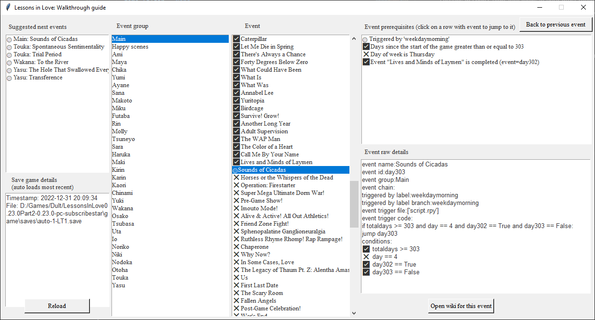

# Lessons In Love Walkthrough Guide Tool

Tired of endlessly clicking to try and figure out what the next event you can trigger in Lessons In Love is? This tool will automatically analyze your save file to give you a hint of what your next action should be and it's prerequisites. End all the endless trial and error to find the next event to trigger!

## Game version supported
This tool is expected to work regardless of game version. However, the v1.1 release of this tool will only include events that were added in v0.28.0 and before.

## Installation - Windows
Download the [latest release](https://github.com/largestack/Lessons-In-Love-Guide-Tool/releases) executable here and run it.

## Installation - Linux or macOS
1. Download and extract the entire repo.
1. Install Python 3.7
1. Install the dependency packages:
* `pip install tkinter`
* `pip install webbrowser`
4. From terminal run `python main.py` or `python3 main.py`.

## Using the tool

1. Run the tool.
1. On first run, it will ask you to select the base game folder.
1. It will automatically load the most recent save-game every time it loads.
1. You can also hit the "Reload" to load the most recent save game again. You can do this to refresh the guide tool while you play the game. Simply save your game, then hit "Reload" to update the guide.

* **Suggested next events**: Click on these events to see what's required for the next suggested events.
* **Event group**: Browse events by character and main path.
* **Event**: The list of events for the selected event group.
* **Event prerequisites**: The requirements for the event to trigger.
* **Event raw details**: Some extra notes about the event.

## Events supported

### Main Events
  * Every Day I Grow Some More
  * A New You
  * Am I Awake?
  * First  Day of School
  * Slumber Party
  * The Devil Incarnate
  * Super Secret Sex Dungeon
  * Delinquent
  * Mitochondria
  * Self-Esteem
  * Operation: Fallen Angel
  * I Thought of You
  * Not Even Me
  * No Romeo
  * Outside of Everything
  * Ponytail
  * Drowning
  * So Many Voices
  * Cleaning Duty
  * Walk in the Park
  * Saved by the Bell
  * This Town Has Two Halves
  * Little Girl
  * Missing
  * The Sakakibara Diet
  * Normal Office Visit
  * O World
  * One to Seven
  * Girl-Talk
  * The 'S' Word
  * Weight Limit
  * Slope Intercept Form
  * Scientific Research
  * Secret Ingredient
  * Parasite
  * Contractions
  * Milk, Eggs, and Water
  * Stronger I Become
  * Recall
  * Rewrite
  * Reset
  * Cursed Birds
  * Human Trafficking
  * Girl Talk Pt. II
  * A Different View
  * On The Bright Side
  * Everything Horrible
  * Erotic Game Protagonist
  * Rumors
  * The Gem of the Emerald Isle
  * Size Matters
  * Tsuneyo Tojo, Stand-up Comedian
  * A Proper Introduction
  * Supreme Overlord
  * Lifting the Curse
  * What's Done is Done
  * All Along the Shoreline
  * My Heart is Full
  * Extra French Fries
  * Behind a Bathroom, Under the Blazing Sun
  * Three Girls in a Line on the Beach
  * The Moon is Beautiful
  * The Legacy of Thaum Pt. I
  * Summer and Winter
  * Where Puppies Roam Free
  * Die For What You Believe In
  * Reverse Cowgirl
  * Smile Guide
  * Prayer Position
  * Cry. Cry. Cry.
  * See You in the Morning
  * The Value of Sharing
  * Guest of Honor
  * The Meat has Come
  * Mysterious Abundance of Chickens
  * Sexy Land
  * They're Just Lights
  * Once, Twice, Ten Times
  * Mechanical Bull
  * At Least It's Not Christmas
  * Samhain
  * Wicked Witch of Kumon-mi
  * The Depressing Implication of Goosebumps
  * Pry With a Smile
  * Kadrillionbilliontrillion
  * As Loud as a Whisper Can Be
  * Two Wooden Doors
  * Happy Places
  * Tradition
  * Stray Cat
  * There is Nothing
  * Changing of Seasons
  * Snow-Covered Footprints
  * Patent-Pending
  * Fuck Christmas
  * Disappointing Everyone
  * Bottled Dreams
  * Christmas Miracle
  * Fireworks, Chicken, and the Innate Fear of Death
  * Suicide Pact
  * A Door that People Move Through
  * Uta's Last Stand
  * Opposites Attract
  * All Kinds of People, All Kinds of Things
  * Caterpillar
  * Let Me Die in Spring
  * There's Always a Chance
  * Forty Degrees Below Zero
  * What Could Have Been
  * What Is
  * What Was
  * Annabel Lee
  * Yuritopia
  * Birdcage
  * Survive! Grow!
  * Another Long Year
  * Adult Supervision
  * The WAP Man
  * The Color of a Heart
  * Call Me By Your Name
  * Lives and Minds of Laymen
  * Sounds of Cicadas
  * Horses or the Whispers of the Dead
  * Operation: Firestarter
  * Super Mega Ultimate Dorm War!
  * Pre-Game Show!
  * Imouto Mode!
  * Alive & Active! All Out Athletics!
  * Friend Zone Fight!
  * Sphenopalatine Ganglioneuralgia
  * Ruthless Rhyme Rhomp! Rap Rampage!
  * Chaperone
  * Why Now?
  * In Some Cases, Love
  * The Legacy of Thaum Pt. Z: Alentha Amastacia
  * Us
  * First Last Date
  * The Scary Room
  * Fallen Angels
  * Post-Game Celebration!
  * War's End
  * Record Breaker
  * Lesbian Stuff
  * Mana Transfer
  * The Price of Experience
  * Word of the Day
  * Backwards Dancing
  * Sayonara
  * Food Groups
  * Permission Slip
  * Good Morning
  * Egg Tossing
  * De-Briefing the Teacher
  * TPK
  * The Next Best Thing
  * The Yellow Wallpaper
  * Everything Ephemeral
  * The Legacy of Thaum Pt. III: Changeling
  * Alderaan
  * Torrential Downpour. Child of Man.
  * Left Out in Light
  * We Were Angels
  * Lavender's Blue
  * Pluto Was Never Really a Planet
  * Try. Try. Try.
  * Goodnight
  * All is Bright. All is Beautiful.
  * Girls in Spandex
  * Butterfly Facts
  * Immernachtreich
  * Take Me Anywhere
  * Anglerfish
  * Porcelain Labyrinth
  * The First Signs of Fraying Threads
  * Official Unofficial Double Date
  * In Circles
  * Escape Rope
  * Lavender's Green
  * Gallows Edge
  * Metal in Microwaves
  * Three Amigos
  * The Reliable and Totally Legitimate Princess Imani
  * Room to Grow
  * Dodging Snowflakes
  * Everything Evil
  * Tokimeki Labyrinth
  * Love Set to Max
  * Dohoonkabhankoloos
  * Fear of Missing Out
  * Walking on Eggshells
  * New Age Entrepreneurs
  * The Smile, The Face
  * Shadowmeld
  * Chashu
  * A Way's Away
  * No Escape
  * Spotless Mind
  * Me Without You
  * The Color White
  * Glued to the Sky
  * The Light of Last Summer
  * A Life of Prizes
  * Utinam Ne Illum Numquam Conspexissem
  * The Virgin of the Apocalypse
  * Memories
  * Empty Eyes
  * The Great Migration
  * Creatures of Habit
  * Everything Everywhere All At Once
  * Normal-ish
  * Life is Changing
  * Dead in the Water
  * The Road to Recovery
  * No Strings Attached
  * Metronome In Love
  * Grief Seed
  * A Walk Through Hell
  * Dorm War II: Pre-Game Show
  * A Frame on a Shelf in a House
  * Gamer Girl Grindfest
  * Hiding in Plain Sight
  * She Is
  * Burden to Bear
  * Everyone
  * Midnight Mom Mosh
  * The Way it Scatters
  * Misfit Maid Madness
  * Somewhere Far From Here
  * Swimming With Sharks
  * Remove Curse
  * The Cracking of the Egg
  * World of Lines
  * Popping Off
  * Tip Your Bartender
  * Redeemer
  * Walk Into the Water
  * Imaginary Veins
  * Friends
  * Chandler's Law
  * The Chains That Bind
  * No Cumming on Christmas
  * Fetch Quest
  * A Thousand Truths
  * The Bending of Italics
  * Treasured
  * いないいない。。。ばあ！
  * Robin Hood
  * The Legacy of Thaum Pt. IV
  * On The Fence
  * To the Future With a Smile
  * Neverender
  * Moon-Touched
  * Smells of Summer
  * I Will Deliver You to the Fireflies
  * Shelter

### Chika
  * The Retail Machine
  * A Dog that Does Math
  * Big Shot Teacher
  * Something About Biting
  * Behind The Curtain
  * Side Event
  * A Castle for Everyone
  * A Dog that Doesn't Do Math
  * Schadenfreude
  * True Power: Unleashed
  * Detention
  * A Trip to the Moon
  * First Hunt
  * Baby it's Cold Outside
  * Little Miracles
  * Bleed
  * Three Words
  * Zanzibar
  * The Princess & The Pauper
  * Into the Woods
  * In Search of Summer
  * Self Care
  * The Gap in the Curtain
  * The Gap in the Door
  * Mating Season

### Yumi
  * Five Million Dollars
  * Micropenis
  * Three Second Smile
  * I See You
  * Fuck The Police
  * Yumi Revitalization Project
  * Worse Comes to Worst
  * Apples to Apples
  * Token Tsundere
  * Great Expectations
  * A Place Like This
  * Caught in the Vortex
  * Where the Sidewalk Ends
  * Walls Too Thick to Hear Through
  * Tech Support
  * Abyss
  * Reconciliation
  * Neon Heart
  * Unsung Heroes
  * See You Around

### Ayane
  * The Unwavering Bravery of Ayane Amamiya
  * Spy on Me
  * The Battle for Kumon-mi
  * Names of Our Children
  * Home Sweet Home
  * Imprinting
  * Far From Fantasy
  * Forever Yours
  * Less Like the Vulture
  * First Words
  * Backwards Spider Crawl
  * Endless Torment
  * Still Young
  * Prisoner
  * Regularly Scheduled Programming
  * Cold Air of an Encroaching Winter
  * First and Second
  * Crazier Things Have Happened
  * Hail Mary
  * One of Many Rooms
  * What a Wonderful World
  * Under the World Tree
  * Crash of Thunder
  * Nevermind
  * Before the Sun Comes Up
  * Out With the Old
  * Chronokinetics
  * How the World Works
  * Chiburi
  * Furlough

### Sana
  * Family Business
  * Nothing to Do
  * The Bare Minimum
  * Recluse
  * Supermom
  * Anywhere At All
  * Carry Me Home
  * Shaking The Tree
  * Scouting Mission
  * Nice Weather We're Having
  * Life is a Tomato
  * The Girl in the Black Dress
  * Self-Medication
  * Tortoises and the Concept of Friendship
  * Purest Intentions
  * Waiting for Anything
  * Closer to Me
  * The Inside of a Triangle
  * Sweet Vermouth
  * The Complete Absence of Everything
  * Mine
  * Melatonin
  * Black Sandy Beaches
  * Ad Meliora
  * It Comes to Claim Us All
  * Ad Infinitum

### Makoto
  * Unexpected Profession
  * Teacher's Pet
  * Watching Porn Alone
  * Completely Platonic
  * Rising of the Tide
  * Frogger
  * Sowing the Seeds
  * Egg Tooth
  * Fishing For Love
  * Quid Pro Quo
  * Declaration of War
  * Studious Teen Virgin
  * Aftermath
  * Residual Sadness
  * Service Charge
  * Bluejay
  * Semblance of a Soul
  * Condoms in the Sand
  * Humans With Hollow Bones
  * I'm Not Here
  * Something, Somewhere
  * Hot Water
  * Whispers of the World
  * Parallelogram
  * White Oak Doors
  * A Beautiful Mind

### Miku
  * Daytime Stalking Pass
  * Behind Closed Doors
  * It's Always Sunny in Kumon-mi
  * Broken Bones
  * Nightvision
  * You and Me and the Night
  * Hormones Running Wild
  * Moments Like This
  * Coach
  * Thighs On-Demand
  * Scaredy Cat
  * An Extra Set of Arms
  * One. Two. Three.
  * Loxonin
  * To Sleep, Perchance to Dream
  * Triple Whammy
  * Speed of Light
  * Acute Love Triangle
  * Chrysalis
  * Someone Else's Skin
  * The Devil & God Are Raging Inside Me

### Rin
  * Guinea Pig
  * The Flavor of Love
  * Haruka
  * Locked Out
  * Skulls
  * Rin's Secret
  * Window of the Waking Mind
  * Boundaries
  * Nothing Was Missing, Except Me
  * Delirium
  * Good Day, Humans
  * Sock Fetish
  * Nothing Was Different
  * Two Steps Back
  * Ten Steps Forward
  * I Died With You
  * Sketchy Basement
  * Semantics
  * Debatably Bisexual Musicians
  * The Art of Never Knowing
  * The Paragon of Not Worrying About Stuff
  * Technicolored Happiness Explosion
  * Lifejacket
  * The Happiest Girl in the World
  * Disaster Lesbian
  * Hot Boy Summer
  * Ever Fallen In Love

### Futaba
  * Impossible Blossoms
  * Fan Fiction
  * Upside Down
  * Unidentical Twins
  * Under the Radar
  * Cutting Through Cocoons
  * Self-Insert
  * Broken Flowers
  * Great Burdock Leaves
  * Clam's Tongue
  * Legs of a Dying Spider
  * Only Child
  * A Book About Dragons
  * Two Hours
  * Like Fucking a Cloud
  * Under the Table
  * A Tree Falls in the Forest
  * No, You
  * Overload
  * Selfless
  * Sonnet 18
  * Floral Aura
  * C'est La Vie
  * Skin
  * Shadowplay
  * Without Running Away
  * Hall of Mirrors
  * This Infected Wound
  * Bestial Vigor
  * Too Blind To See
  * Toys

### Ami
  * Harem Tutorial
  * Uninvited
  * The Queen of Spiders
  * Home Away From Home
  * Something Darker
  * Couple's Discount
  * Ode to a Marsh Warbler
  * No One Can See Us
  * Walking on Air
  * Back Out in the Heat
  * Important Things
  * Wake Up Call
  * Cute Girls and Stuff
  * Divergence
  * Such Small Hands
  * Everlasting Love
  * Living
  * Rising to the Challenge
  * Best Friends Forever
  * Third Place
  * The Big Sleep
  * Heaven for Human Blood
  * As Light as Air
  * Conscious or Not
  * Outcry of the Hunted Hare
  * Fruits of the Two Seasons
  * My Life With You
  * Somnambula
  * No One Can Hear Us

### Maya
  * A New Beginning
  * Mondays
  * Different Worlds
  * Secrets Worth Keeping
  * Past/Present/Future
  * Rewind/Repeat/Refuse
  * You and Me
  * Takoyaki
  * Nothing is Real
  * Close Your Eyes
  * Watermelons and Violin
  * FLAVOR BEAM!
  * What it Means to Be Destroyed
  * Now More Than Ever
  * A Place That Can Only Exist in Our Minds
  * Stop Looking For Answers
  * Somewhere Inside of a Dream
  * Three Halves Make a Whole
  * As The Sun Disappears
  * Everlasting Mercy

### Molly
  * NTR & Pregnancy
  * The Cult of Molly
  * Remnants of Forgotten Memes
  * Torrent of Power
  * Something Out of a Nukige
  * The Dark Entity
  * Onward to Valhalla
  * Unpaid Promotion
  * The Legacy of Thaum Pt. II
  * Ahead of the Curve
  * Resurrection Sickness
  * Tír na nÓg
  * Transmogrification
  * Walkthrough

### Tsuneyo
  * Snake Venom
  * The Life of a Blue Whale
  * Between the Slurps of Pork Broth
  * Drug Use & Jump-Rope
  * A Short List
  * The Man Who Loves Nothing
  * Seeds
  * Moe Fan Service
  * Fucking...Or What it Means to Live
  * Blackout
  * Like Noodles in the Wind
  * Green Onions and Contraceptives
  * Unsleeping Aegis
  * Things Like Stairs

### Uta
  * Far From Home
  * Abuse of Power
  * Love Me to Pieces
  * The VIP Treatment
  * Shawshank Redemption
  * Happier Things
  * Facetime With My Mom
  * Veins and the Circulatory System
  * Blood Everywhere
  * Impulse
  * Where Wishes Come True
  * After the Rain
  * Uta-chan

### Io
  * Viva la Revolución
  * Nonetheless, I'm Here
  * The Girl with the Dragon Tattoo
  * Unnamed Wooden Robots
  * Paperthin
  * Turn On The Lights
  * Amongst Other Things
  * One Man's Trash
  * Another Man's Treasure
  * Cupid's Arrow
  * Work Less, Not Hard
  * Heartbreak & Harmony
  * 1999 PC Classic, Rollercoaster Tycoon

### Nodoka
  * Humbert Humbert
  * The Man Who Would Be King
  * Cracks in the Armor
  * Coloring Book
  * I See Everything
  * Beyond the Reach of God
  * So Far Below
  * Matador
  * Things That Hurt
  * Twisting Ivy

### Otoha
  * Everybody Loves Otoha
  * Conversations Outside of a Girls’ Dorm
  * Japanese Summer
  * Locked In
  * Highly Pornographic
  * Pull the Plug
  * Two-Octave Pitch Glide
  * Breathing in Unison
  * Vanilla Bean

### Touka
  * Spontaneous Sentimentality
  * Trial Period
  * Fish Out of Water
  * A Brief Moment in Time
  * Loser
  * House Call
  * A Commoner's Tour of Summer
  * Red-ish Light District
  * Something Less Lonely

### Yasu
  * The Hole That Swallowed Everything
  * Transference
  * Armor of Older Gods
  * Repentance
  * Sakura Season
  * Down The Rabbit Hole
  * Sore Thumb
  * Mother Duck
  * Glossolalia
  * The River Styx

### Noriko
  * Sculpture
  * Nakayarakawayama
  * Semi-Constructive Criticism
  * Mouthjob
  * Kind Of, Yes. Kind Of, No.
  * New Shoes
  * Beginnings. Endings. Things in Between.
  * Fair & Square
  * Homes for the Homeless
  * That One FMK Scene
  * Loxosceles Reclusa

### Sara
  * A Woman's Heart
  * Zero Friction
  * Third Wheel
  * A Mostly Empty Home
  * Medical Assistance
  * Uptown Girl
  * She's Always a Woman
  * Tell Me When
  * The Place She Falls Asleep At Night
  * Engulfed
  * Engulfed

### Haruka
  * Drunk Again
  * Invisible Worm
  * The Need to be Hurt
  * Bad Kitty
  * Performance Review
  * Watching TV Alone
  * Shades of Green
  * Roses
  * Sober-ish
  * Unfiltered Tap Water
  * The World Outside The Walls
  * To Anyone Who Passes By
  * Again, I Can't Recall
  * Secret Weapon

### Maki
  * Beautiful Porn Salesman
  * Maki Miyamura's Mom-Mode Mission
  * A Fair Trade
  * Three Afloat On One Raft
  * Thank You For Your Business
  * Traveling Lube Dealer
  * Special Occasions
  * Adulting
  * Rolling Stop
  * Baby Steps

### Kaori
  * How to Date a Human
  * The Best Ways to Rub a Cock
  * Objects and Appendages
  * To Die, To Sleep
  * Sad Girl Special
  * Clouds
  * Såsom i en Spegel
  * Wither

### Karin
  * Further and Further
  * Walking Penis Monster
  * If Only
  * Dying Alone With Ten Cats
  * Tendrils of Flame
  * The Adventures of Karli & Steve
  * Sweet Tooth
  * Emerald Eyes
  * Wrong Places/Wrong Times

### Kirin
  * Partners in Crime
  * Long and Hard
  * Politics! Pleasure! Ponies!
  * Full Blossom
  * Too Much, All at Once
  * No Extortion Necessary
  * Morals vs. Orgasms
  * Love, Dorms, and Other Things
  * Flickering Spotlight
  * Enigmatology
  * Bye Bye, Boner
  * Terms & Conditions
  * All That is Contaminated
  * Taking the Reins
  * Taking the Reins
  * Dyed Orange, Drenched in Sun
  * Temporary Bliss
  * Four Hand Massage
  * Made Out of Nothing
  * The Other Half
  * Falling Asleep Standing Up

### Chinami
  * 5,000 Year-Old Wizard
  * Chinami-Corp
  * Giant Pool of Jell-O
  * Pool Party
  * Happy Hour
  * Death Trap
  * Bad News Bears

### Niki
  * Cotton Candy
  * Like it's Any Other Day
  * Thousands, If Not Millions
  * Hotel Rooms
  * Sisters
  * Dear You

### Yuki
  * Rule #1
  * Better Off Alone
  * Opposite Directions
  * A Thing of the Past

### Wakana
  * To the River
  * Soup, or Another Year With You
  * Pseudonym
  * Don't Hold Back

### Osako
  * Pressure Point
  * Floating Forever, Unfulfilled
  * Young At Heart
  * House of the Unholy

### Tsubasa
  * Everbloom
  * The Deep End

### Tsukasa
  * National Tsukasa Day
  * Jeeves Tsukioka XIII

### Imani
  * Somewhere I Belong
  * A Hairline Fracture

